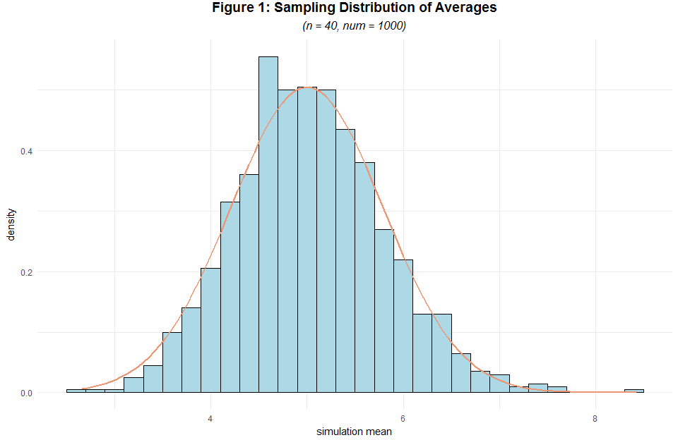
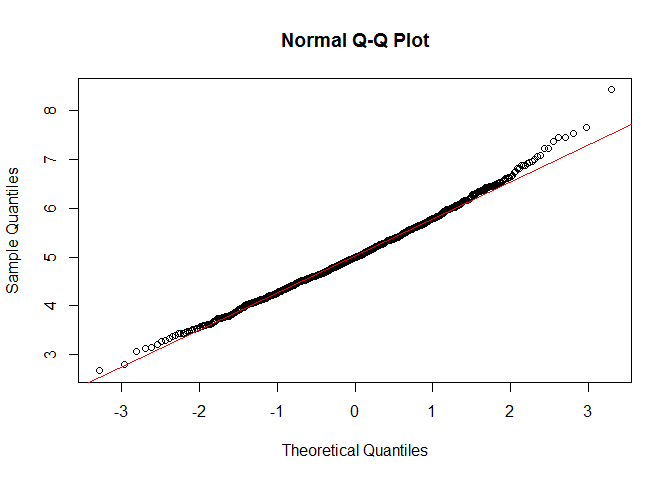
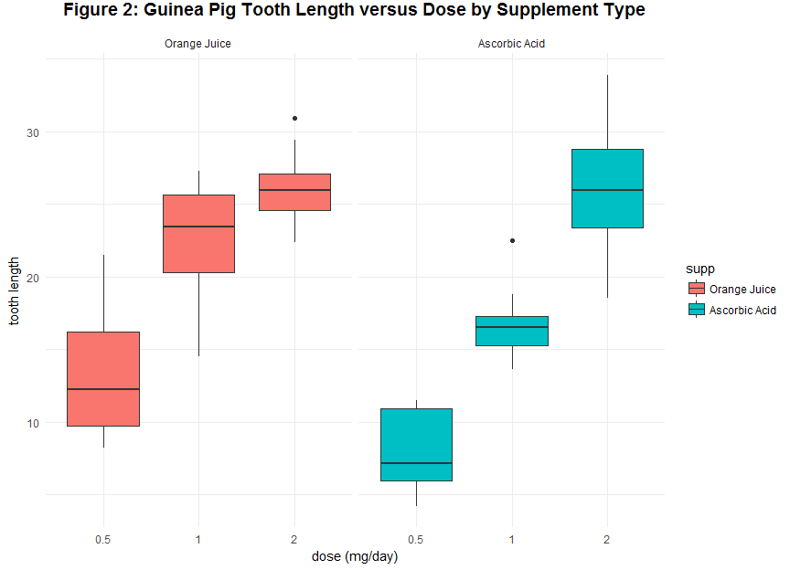

***
# Synopsis
***

This is the final project for the Statistical Inference course in the Data Science specialization on Coursera. I will explore exponential distribution with simulation and perform some simple inferential data analysis on the data set `ToothGrowth` in the R datasets package.

In the simulation part, I will work on:

* Simulating from the exponentially distributed population;
* Comparing the sampling distribution of mean and variance with those of the theoretical distribution

In the inferential data analysis part, I will work on:

* Basic hypothesis testing via t-test

***
# Simulation
***

The theoretical population that I'll work with is exponentially distributed. The mean of exponential distribution is $\frac{1}{\lambda}$ and the standard deviation is also $\frac{1}{\lambda}$, where $\lambda$ is the rate parameter.

The exponential distribution can be simulated in R with `rexp(n, $\lambda$)`. Set __$\lambda=0.2$__ for all of the __1,000__ simulations and regard them as [IID](https://en.wikipedia.org/wiki/Independent_and_identically_distributed_random_variables) drawed. Draw __40__ exponentials for each simulation, calculate the mean of each simulation and get the sampling distribution of the calculated averages.


```r
# set seed for reproducability
set.seed(999)

# set parameters
lambda <- 0.2
n <- 40
simulations <- 1000

# simulate
simu_exp <- replicate(simulations, rexp(n, lambda))

# calculate mean of exponentials
mean.simu_exp <- apply(simu_exp, 2, mean)
```

## Sample Mean versus Theoretical Mean

First calculate the sample mean (rounded to three digits), i.e. mean of the sampling distribution, and compare it with the theoretical mean, which is $\frac{1}{\lambda}=\frac{1}{0.2}=5$. Only minute difference is found.


```r
mean.means <- round(mean(mean.simu_exp), digits = 3)
mean.means
```

```
## [1] 5.029
```

```r
abs((mean.means - 1/lambda))
```

```
## [1] 0.029
```


## Sample Variance versus Theoretical Variance

Also calculate the sample variance (rounded to three digits), i.e. variance of the sampling distribution, and compare it with the theoretical variance, which is $\frac{\frac{1}{\lambda}}{\sqrt{n}}=\frac{\frac{1}{0.2}}{\sqrt{40}}=0.791$. Likewise, only minute difference is found.


```r
var.means <- round(sd(mean.simu_exp), digits = 3)
var.means
```

```
## [1] 0.778
```

```r
abs(var.means - 0.791)
```

```
## [1] 0.013
```

## Distribution

According to [CLT](https://en.wikipedia.org/wiki/Central_limit_theorem), the sampling distribution with relatively large sample size (1,000 in our case) should be approximately normally distributed. Compare the empirical sampling distribution with a normal distribution with $\mu=\frac{1}{\lambda}$ and $sd=\frac{1}{\lambda\sqrt{n}}$.


```r
if(!require(ggplot2)){install.packages('ggplot2')}
```

```
## Loading required package: ggplot2
```

```r
simus <- data.frame(simus = c(mean.simu_exp))
ggplot(simus, aes(x = simus)) + geom_histogram(aes(y=..density..), binwidth=0.2, fill="lightblue", color="black") +
  stat_function(fun = dnorm, args = list(mean = lambda^-1, sd = (lambda*sqrt(n))^-1), size = 1, color="lightsalmon2") + theme_minimal() +
  labs(title = "Figure 1: Sampling Distribution of Averages", subtitle = "(n = 40, num = 1000)", x = "simulation mean") + theme(plot.title = element_text(hjust = 0.5, vjust = 3, size = 14, face = "bold"), plot.subtitle = element_text(hjust = 0.5, vjust = 3, size = 12, face = "italic"))
```

<!-- -->

Here the sampling distribution of simulation averages is very similar to a normal distribution. Use a [Q-Q plot](https://en.wikipedia.org/wiki/Q%E2%80%93Q_plot) to confirm our intuitive guess.


```r
qqnorm(mean.simu_exp)
qqline(mean.simu_exp, col = 2)
```

<!-- -->

The scatter points converges pretty well to the Q-Q line. Conclude that CLT works pretty well in this case with 1,000 simulations and 40 simulated samples each. 

***
# Inferential Data Analysis
***

The following data analysis analyzes the `ToothGrowth` data set by comparing the tooth growth by supplement and dose. According to C. I. Bliss (1952), the response is the length of odontoblasts (cells responsible for tooth growth) in 60 guinea pigs. Each animal received one of three dose levels of vitamin C (0.5, 1, and 2 mg/day) by one of two delivery methods, orange juice or ascorbic acid (a form of vitamin C and coded as VC). The data set is formated as below:

Variable | Type | Definition
-------- | ---------- | -----
len | numeric | Tooth length
supp | factor | Supplement type (VC or OJ).
dose | numeric | Dose in mg/day

Table: Table 1

First, load the data and do some exploratory analysis.


```r
if(!require(datasets)){install.packages('datasets')}
data(ToothGrowth)
head(ToothGrowth)
```

```
##    len supp dose
## 1  4.2   VC  0.5
## 2 11.5   VC  0.5
## 3  7.3   VC  0.5
## 4  5.8   VC  0.5
## 5  6.4   VC  0.5
## 6 10.0   VC  0.5
```

## Exploratory Data Analysis


```r
levels(ToothGrowth$supp) <- c("Orange Juice", "Ascorbic Acid")
ggplot(ToothGrowth, aes(x = factor(dose), y = len)) + facet_grid(. ~ supp) + geom_boxplot(aes(fill = supp)) + theme_minimal() + 
  labs(x="dose (mg/day)", y="tooth length") + ggtitle("Figure 2: Guinea Pig Tooth Length versus Dose by Supplement Type") + theme(plot.title = element_text(hjust = 0.5, vjust = 3, size = 14, face = "bold"))
```

<!-- -->

A pattern can be obviously discovered with the panel above, we guess that tooth length is positively associated with dose and the effect of dose on tooth length varies across supplement types. There might not be much difference between average tooth growth of the orange juice group and the ascorbic acid group on dose level of 2.0 mg.

## Data Summary


```r
summary(ToothGrowth)
```

```
##       len                   supp         dose      
##  Min.   : 4.20   Orange Juice :30   Min.   :0.500  
##  1st Qu.:13.07   Ascorbic Acid:30   1st Qu.:0.500  
##  Median :19.25                      Median :1.000  
##  Mean   :18.81                      Mean   :1.167  
##  3rd Qu.:25.27                      3rd Qu.:2.000  
##  Max.   :33.90                      Max.   :2.000
```

## Hypothesis Testing

### Tooth Growth by Supplement via t-Test

Test the hypothesis that ceteris paribus, tooth growth is deifferent across delivery methods. In other words, use a two tailed t-test under the significance level of 0.05 with unequal variances across supplement groups to test the null hypothesis that $H_0: \mu_1=\mu_2$, where $\mu_1$ denotes the mean tooth growth in the `Orange Juice` group and $\mu_2$ denotes the mean tooth growth in the `Ascorbic Acid` group, with an alternative that $H_1: \mu_1\ne\mu_2$.


```r
t.test(data = ToothGrowth, len ~ supp, paired = F, var.equal = F, alternative = "two.sided")
```

```
## 
## 	Welch Two Sample t-test
## 
## data:  len by supp
## t = 1.9153, df = 55.309, p-value = 0.06063
## alternative hypothesis: true difference in means is not equal to 0
## 95 percent confidence interval:
##  -0.1710156  7.5710156
## sample estimates:
##  mean in group Orange Juice mean in group Ascorbic Acid 
##                    20.66333                    16.96333
```

Accroding to the test result above, there is no sufficient evidence to conclude that tooth growth varies across delivery methods, under a significance level of 0.05.

### Tooth Growth by Dose via t-Test

Test the hypothesis that ceteris paribus, tooth growth is deifferent across dose. Note here although `dose` is numerical, we should convert it into factorial as it only takes three values as shown below.


```r
if(!require(dplyr)){install.packages('dplyr')}
unique(ToothGrowth$dose)
```

```
## [1] 0.5 1.0 2.0
```

```r
ToothGrowth <- mutate(ToothGrowth, dose = as.factor(dose))
```

Use a two tailed t-test under the significance level of 0.05 with unequal variances across dose levels to test the null hypothesis that $H_0: \mu_1=\mu_2$, where $\mu_1$ denotes the mean tooth growth in dose level of 0.5 and $\mu_2$ denotes the mean tooth growth in dose level of 1, with an alternative that $H_1: \mu_1\ne\mu_2$.


```r
h0.1 <- t.test(data = ToothGrowth[ToothGrowth$dose %in% c("0.5", "1"),], len ~ dose, paired = F, var.equal = F, alternative = "two.sided")
h0.1
```

```
## 
## 	Welch Two Sample t-test
## 
## data:  len by dose
## t = -6.4766, df = 37.986, p-value = 1.268e-07
## alternative hypothesis: true difference in means is not equal to 0
## 95 percent confidence interval:
##  -11.983781  -6.276219
## sample estimates:
## mean in group 0.5   mean in group 1 
##            10.605            19.735
```

Likewise, use a two tailed t-test under the significance level of 0.05 with unequal variances across dose levels to test the null hypothesis that $H_0: \mu_1=\mu_3$, where $\mu_3$ denotes the mean tooth growth in dose level of 2, with an alternative that $H_1: \mu_1\ne\mu_3$.


```r
h0.2 <- t.test(data = ToothGrowth[ToothGrowth$dose %in% c("0.5", "2"),], len ~ dose, paired = F, var.equal = F, alternative = "two.sided")
h0.2
```

```
## 
## 	Welch Two Sample t-test
## 
## data:  len by dose
## t = -11.799, df = 36.883, p-value = 4.398e-14
## alternative hypothesis: true difference in means is not equal to 0
## 95 percent confidence interval:
##  -18.15617 -12.83383
## sample estimates:
## mean in group 0.5   mean in group 2 
##            10.605            26.100
```

Further, use a two tailed t-test under the significance level of 0.05 with unequal variances across dose levels to test the null hypothesis that $H_0: \mu_2=\mu_3$, with an alternative that $H_1: \mu_2\ne\mu_3$.


```r
h0.3 <- t.test(data = ToothGrowth[ToothGrowth$dose %in% c("1", "2"),], len ~ dose, paired = F, var.equal = F, alternative = "two.sided")
h0.3
```

```
## 
## 	Welch Two Sample t-test
## 
## data:  len by dose
## t = -4.9005, df = 37.101, p-value = 1.906e-05
## alternative hypothesis: true difference in means is not equal to 0
## 95 percent confidence interval:
##  -8.996481 -3.733519
## sample estimates:
## mean in group 1 mean in group 2 
##          19.735          26.100
```
 
Print a summary of the tested hypothesis, corresponding t-statistic, p-value and confidence interval.
 

```r
if(!require(kableExtra)){install.packages('kableExtra')}
```

```
## Loading required package: kableExtra
```

```r
sumtable <- data.frame(Tested.Hypothesis = c("0.5 mg - 1.0 mg", "0.5 mg - 2.0 mg", 
                                      "1.0 mg - 2.0 mg"), 
                       t.Statistic = c(round(h0.1$statistic, digits = 3), 
                                       round(h0.2$statistic, digits = 3), 
                                       round(h0.3$statistic, digits = 3)), 
                       p.value = c(round(h0.1$p.value, digits = 3), 
                                   round(h0.2$p.value, digits = 3), 
                                   round(h0.3$p.value, digits = 3)), 
                       Confidence.Interval = c(paste("[ ", round(h0.1$conf.int[1], digits = 3), " , ", round(h0.1$conf.int[2], digits = 3), " ]", sep = ""),
                                            paste("[ ", round(h0.2$conf.int[1], digits = 3), " , ", round(h0.2$conf.int[2], digits = 3), " ]", sep = ""),
                                            paste("[ ", round(h0.3$conf.int[1], digits = 3), " , ", round(h0.3$conf.int[2], digits = 3), " ]", sep = ""))
)
sumtable %>%
  kable("html") %>%
  kable_styling(position = "center")
```

<table class="table" style="margin-left: auto; margin-right: auto;">
 <thead>
  <tr>
   <th style="text-align:left;"> Tested.Hypothesis </th>
   <th style="text-align:right;"> t.Statistic </th>
   <th style="text-align:right;"> p.value </th>
   <th style="text-align:left;"> Confidence.Interval </th>
  </tr>
 </thead>
<tbody>
  <tr>
   <td style="text-align:left;"> 0.5 mg - 1.0 mg </td>
   <td style="text-align:right;"> -6.477 </td>
   <td style="text-align:right;"> 0 </td>
   <td style="text-align:left;"> [ -11.984 , -6.276 ] </td>
  </tr>
  <tr>
   <td style="text-align:left;"> 0.5 mg - 2.0 mg </td>
   <td style="text-align:right;"> -11.799 </td>
   <td style="text-align:right;"> 0 </td>
   <td style="text-align:left;"> [ -18.156 , -12.834 ] </td>
  </tr>
  <tr>
   <td style="text-align:left;"> 1.0 mg - 2.0 mg </td>
   <td style="text-align:right;"> -4.900 </td>
   <td style="text-align:right;"> 0 </td>
   <td style="text-align:left;"> [ -8.996 , -3.734 ] </td>
  </tr>
</tbody>
</table>

According to the test results above, we can reject the null hypotheses and conclude that ceteris paribus, average tooth growth is different across levels of dose, under a significance level of 0.05. As all the confidence intervals lies below 0, we expect a positive relationship.

### Tooth Growth by Supplement and Dose via t-Test

It seems too early to conclude that tooth growth is independent from supplement (recall the pattern we observed in figure 2). Further test the significance of supplement effects conditioned on dose, i.e. take both IVs into consideration. In my analysis, the effects of supplement conditioned on dose were tested.

Use a two tailed t-test under the significance level of 0.05 with unequal variances across supplement groups __conditioned on dose level of 0.5 mg__ to test the null hypothesis that $H_0: \mu_1=\mu_2$, where $\mu_1$ denotes the mean tooth growth in the `Orange Juice` group and $\mu_2$ denotes the mean tooth growth in the `Ascorbic Acid` group on a dose level of 0.5 mg, with an alternative that $H_1: \mu_1\ne\mu_2$.


```r
h1.1 <- t.test(data = ToothGrowth[ToothGrowth$dose %in% c("0.5"),], len ~ supp, paired = F, var.equal = F, alternative = "two.sided")
h1.1
```

```
## 
## 	Welch Two Sample t-test
## 
## data:  len by supp
## t = 3.1697, df = 14.969, p-value = 0.006359
## alternative hypothesis: true difference in means is not equal to 0
## 95 percent confidence interval:
##  1.719057 8.780943
## sample estimates:
##  mean in group Orange Juice mean in group Ascorbic Acid 
##                       13.23                        7.98
```

Likewise, use a two tailed t-test under the significance level of 0.05 with unequal variances across supplement groups __conditioned on dose level of 1.0 mg__ to test the null hypothesis that $H_0: \mu_1=\mu_2$,where $\mu_1$ denotes the mean tooth growth in the `Orange Juice` group and $\mu_2$ denotes the mean tooth growth in the `Ascorbic Acid` group on a dose level of 1.0 mg, with an alternative that $H_1: \mu_1\ne\mu_2$.


```r
h1.2 <- t.test(data = ToothGrowth[ToothGrowth$dose %in% c("1"),], len ~ supp, paired = F, var.equal = F, alternative = "two.sided")
h1.2
```

```
## 
## 	Welch Two Sample t-test
## 
## data:  len by supp
## t = 4.0328, df = 15.358, p-value = 0.001038
## alternative hypothesis: true difference in means is not equal to 0
## 95 percent confidence interval:
##  2.802148 9.057852
## sample estimates:
##  mean in group Orange Juice mean in group Ascorbic Acid 
##                       22.70                       16.77
```

Last, use a two tailed t-test under the significance level of 0.05 with unequal variances across supplement groups __conditioned on dose level of 2.0 mg__ to test the null hypothesis that $H_0: \mu_1=\mu_2$, where $\mu_1$ denotes the mean tooth growth in the `Orange Juice` group and $\mu_2$ denotes the mean tooth growth in the `Ascorbic Acid` group on a dose level of 2.0 mg, with an alternative that $H_1: \mu_1\ne\mu_2$.


```r
h1.3 <- t.test(data = ToothGrowth[ToothGrowth$dose %in% c("2"),], len ~ supp, paired = F, var.equal = F, alternative = "two.sided")
h1.3
```

```
## 
## 	Welch Two Sample t-test
## 
## data:  len by supp
## t = -0.046136, df = 14.04, p-value = 0.9639
## alternative hypothesis: true difference in means is not equal to 0
## 95 percent confidence interval:
##  -3.79807  3.63807
## sample estimates:
##  mean in group Orange Juice mean in group Ascorbic Acid 
##                       26.06                       26.14
```

Further, print a summary table of the tested hypothesis, corresponding t-statistic, p-value and confidence interval.
 

```r
sumtable2 <- data.frame(Conditioned.Dose = c("0.5 mg", "1.0 mg", "2.0 mg"), 
                       t.Statistic = c(round(h1.1$statistic, digits = 3), 
                                       round(h1.2$statistic, digits = 3), 
                                       round(h1.3$statistic, digits = 3)), 
                       p.value = c(round(h1.1$p.value, digits = 3), 
                                   round(h1.2$p.value, digits = 3), 
                                   round(h1.3$p.value, digits = 3)), 
                       Confidence.Interval = c(paste("[ ", round(h1.1$conf.int[1], digits = 3), " , ", round(h1.1$conf.int[2], digits = 3), " ]", sep = ""),
                                            paste("[ ", round(h1.2$conf.int[1], digits = 3), " , ", round(h1.2$conf.int[2], digits = 3), " ]", sep = ""),
                                            paste("[ ", round(h1.3$conf.int[1], digits = 3), " , ", round(h1.3$conf.int[2], digits = 3), " ]", sep = ""))
)
sumtable2 %>%
  kable("html") %>%
  kable_styling(position = "center")
```

<table class="table" style="margin-left: auto; margin-right: auto;">
 <thead>
  <tr>
   <th style="text-align:left;"> Conditioned.Dose </th>
   <th style="text-align:right;"> t.Statistic </th>
   <th style="text-align:right;"> p.value </th>
   <th style="text-align:left;"> Confidence.Interval </th>
  </tr>
 </thead>
<tbody>
  <tr>
   <td style="text-align:left;"> 0.5 mg </td>
   <td style="text-align:right;"> 3.170 </td>
   <td style="text-align:right;"> 0.006 </td>
   <td style="text-align:left;"> [ 1.719 , 8.781 ] </td>
  </tr>
  <tr>
   <td style="text-align:left;"> 1.0 mg </td>
   <td style="text-align:right;"> 4.033 </td>
   <td style="text-align:right;"> 0.001 </td>
   <td style="text-align:left;"> [ 2.802 , 9.058 ] </td>
  </tr>
  <tr>
   <td style="text-align:left;"> 2.0 mg </td>
   <td style="text-align:right;"> -0.046 </td>
   <td style="text-align:right;"> 0.964 </td>
   <td style="text-align:left;"> [ -3.798 , 3.638 ] </td>
  </tr>
</tbody>
</table>

According to the test results above, __conditioned on dose levels of 0.5 mg and 1.0 mg__, we can reject the null hypotheses and conclude that average tooth growth is different across types of supplement, under a significance level of 0.05. Here all the confidence intervals are above 0, we expect a positive effect of orange juice over ascorbic acid conditioned on a dose level of 0.5 mg or 1.0 mg. When the dose level equals 2.0 mg, the difference in average tooth growth is no longer significant.


## Conclusions and Assumptions

Based on the simple inferential data analysis above, we conclude that:

* There is no strong evidence indicating that tooth length varies based on delivery methods independent of dose level; 
* However, there is significant evidence showing that it varies when the dose level is contolled at either 0.5mg or 1.0 mg, under a significance level of 0.05, and expect a postive effect of orange juice over ascorbic acid as a better delivery method;
* We are 95% confident that tooth length varies across levels of dose and expect a positive relationship between tooth growth and dosage

The underlying assumptions include:

* Populations of guinea pigs were independent;
* Variances across groups are NOT equal, which is rather conservative
