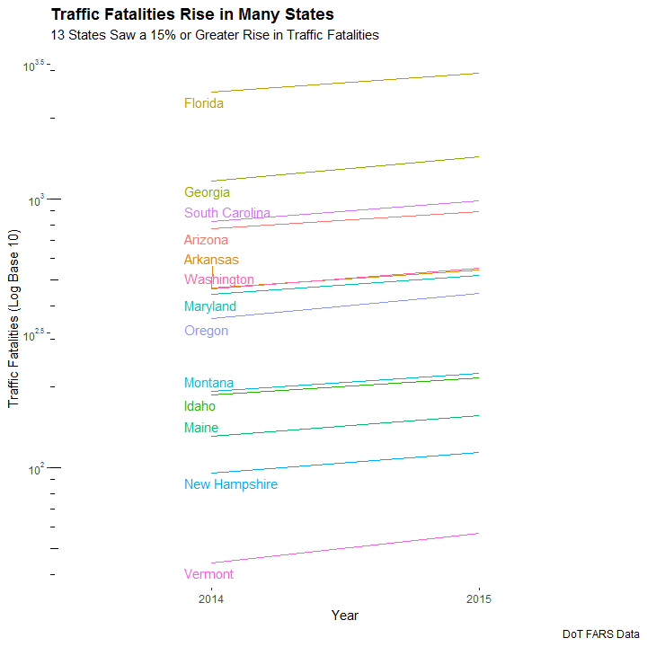

# Download and Read Data

Download and use The Department of Transportation¡¯s (DoT) Fatality Analysis Reporting System (FARS) data. Download corresponding `.zip` files and unzip them to get `accident.sas7bdat` for th year 2014 and `accident.csv` for 2015.


```r
# set working directory (Windows machine)
setwd("D:/My Documents/MathCamp/Coding Lab")

# download 2014 SAS data files
if(!file.exists("FARS2014NationalSAS.zip")){
        download.file("ftp://ftp.nhtsa.dot.gov/FARS/2014/National/FARS2014NationalSAS.zip", 
                      "FARS2014NationalSAS.zip")
        dateDownloaded <- date()}

# unzip and read 2014 SAS data
unzip("FARS2014NationalSAS.zip", files = 'accident.sas7bdat')

library(haven)
acc2014 <- read_sas('accident.sas7bdat')

# likewise, download 2015 CSV data files
if(!file.exists("FARS2015NationalCSV.zip")){
        download.file("ftp://ftp.nhtsa.dot.gov/FARS/2015/National/FARS2015NationalCSV.zip", 
                      "FARS2015NationalCSV.zip")
        dateDownloaded1 <- date()}

# unzip and read 2015 CSV data
unzip("FARS2015NationalCSV.zip", files = 'accident.csv')

library(tidyverse)
acc2015 <- read_csv('accident.csv')
```

# Data Pre-Processing


```r
# replace empty strings with NA
acc2014 <- acc2014 %>%
        mutate(TWAY_ID2 = na_if(TWAY_ID2, ""))
```

The replacement is successful, there are 22264 values missing in the `"TWAY_ID2"` column of `acc2014`.


```r
# check data dimensions
dim(acc2014)
```

```
## [1] 30056    50
```

```r
dim(acc2015)
```

```
## [1] 32539    52
```

```r
# see columns in `acc2014` but not `acc2015`
colnames(acc2015)[!(colnames(acc2014) %in% colnames(acc2015))]
```

```
## [1] "RUR_URB"
```

```r
# see columns in `acc2015` but not `acc2014`
colnames(acc2014)[!(colnames(acc2015) %in% colnames(acc2014))]
```

```
## [1] "ROAD_FNC" "ROUTE"    "TWAY_ID"
```

The number of columns differs. While the `"RUR_URB"` column is in `acc2014` but not `acc2015`, `"ROAD_FNC"`, `"ROUTE"` and `"TWAY_ID"` are missing from `acc2014`.


```r
# bind two tibbles
acc <- bind_rows(acc2014, acc2015)

# check missing values in the "RUR_URB" column of `acc`
sum(is.na(acc$RUR_URB))
```

```
## [1] 30056
```

When row-binding, columns are matched by name, and any missing columns will be filled with NA. Since `"RUR_URB"` column in the binded tibble `acc` is originally missing from `acc2015`, it contains a lot of missing values.

Download Federal Information Processing Standards (FIPS) data manually in `fips.csv` and read the dataset as `fips`.


```r
# read fips data
fips <- read_csv("fips.csv")

# glimpse fips
glimpse(fips)
```

```
## Observations: 3,142
## Variables: 4
## $ StateName      <chr> "Alabama", "Alabama", "Alabama", "Alabama", "Al...
## $ CountyName     <chr> "Autauga", "Baldwin", "Barbour", "Bibb", "Bloun...
## $ StateFIPSCode  <chr> "01", "01", "01", "01", "01", "01", "01", "01",...
## $ CountyFIPSCode <chr> "001", "003", "005", "007", "009", "011", "013"...
```

Merge `acc` with `fips` on `"StateFIPSCode"` and `"CountyFIPSCode"`.


```r
acc <- acc %>%
        mutate(STATE = as.character(STATE),
               COUNTY = as.character(COUNTY),
               STATE = str_pad(STATE, width = 2, side = "left", pad = "0"),
               COUNTY = str_pad(COUNTY, 3, "left", "0")) %>%
        left_join(fips, by = c("STATE" = "StateFIPSCode", "COUNTY" = "CountyFIPSCode"))
```

# Exploratory Data Analysis

Calculate total fatilities by state and year. Spread the resulting summary table as `agg_wide`, with total fatilities in 2014 as `"Year2014"` and those of 2015 as `"Year2015"`.

Also, calculate the percent difference between 2014 and 2015 fatalities for each state as `"Diff_Percent"`, arrange `agg_wide` by the percent difference in ascending order and only keep those with a percent difference larger than $15\%$.


```r
# summarize total fatalities by state and year
agg <- acc %>%
        group_by(StateName, YEAR) %>%
        summarize(TOTAL = sum(FATALS))

# save years as column names
agg_wide <- agg %>%
        spread(key = 'YEAR', value = "TOTAL") %>%
        setNames(c("StateName", "Year2014", "Year2015")) %>%
        mutate(Diff_Percent = (Year2015 - Year2014)/Year2014) %>%
        arrange(Diff_Percent) %>%
        filter(Diff_Percent > 0.15,
               !is.na(StateName)) 

# inspect `agg_wide`
glimpse(agg_wide)
```

```
## Observations: 13
## Variables: 4
## $ StateName    <chr> "Arizona", "Idaho", "Montana", "Arkansas", "Maryl...
## $ Year2014     <dbl> 773, 186, 192, 466, 442, 2494, 823, 131, 462, 95,...
## $ Year2015     <dbl> 895, 216, 224, 545, 520, 2938, 979, 156, 551, 114...
## $ Diff_Percent <dbl> 0.1578266, 0.1612903, 0.1666667, 0.1695279, 0.176...
```

Lastly, recreate the graph.


```r
# set the dataset for plotting
agg_sel <- agg %>%
        filter(StateName %in% agg_wide$StateName)

library(ggrepel)

ggplot(agg_sel, aes(x = factor(YEAR), y = TOTAL, color = StateName, group = StateName)) + 
        geom_line() + 
        geom_text_repel(label = ifelse(agg_sel$YEAR == 2014,
                                       agg_sel$StateName,
                                       ""),
                        nudge_x = -0.25,
                        direction = "y",
                        hjust = 0) + 
        scale_y_continuous(trans = "log10", 
                           limits = c(40, 10^3.6),
                           breaks = c(10^2, 10^2.5, 10^3, 10^3.5),
                           labels = expression(10^{2}, 10^{2.5}, 10^{3}, 10^{3.5})) + 
        theme_minimal() + 
        labs(x = 'Year', y = 'Traffic Fatalities (Log Base 10)', 
             title = 'Traffic Fatalities Rise in Many States', 
             subtitle = "13 States Saw a 15% or Greater Rise in Traffic Fatalities",
             caption = "DoT FARS Data") +
        theme_classic() +
        theme(legend.position = "none",
              axis.line.y = element_blank(),
              axis.line.x = element_blank(),
              plot.title = element_text(face = "bold"))
```



