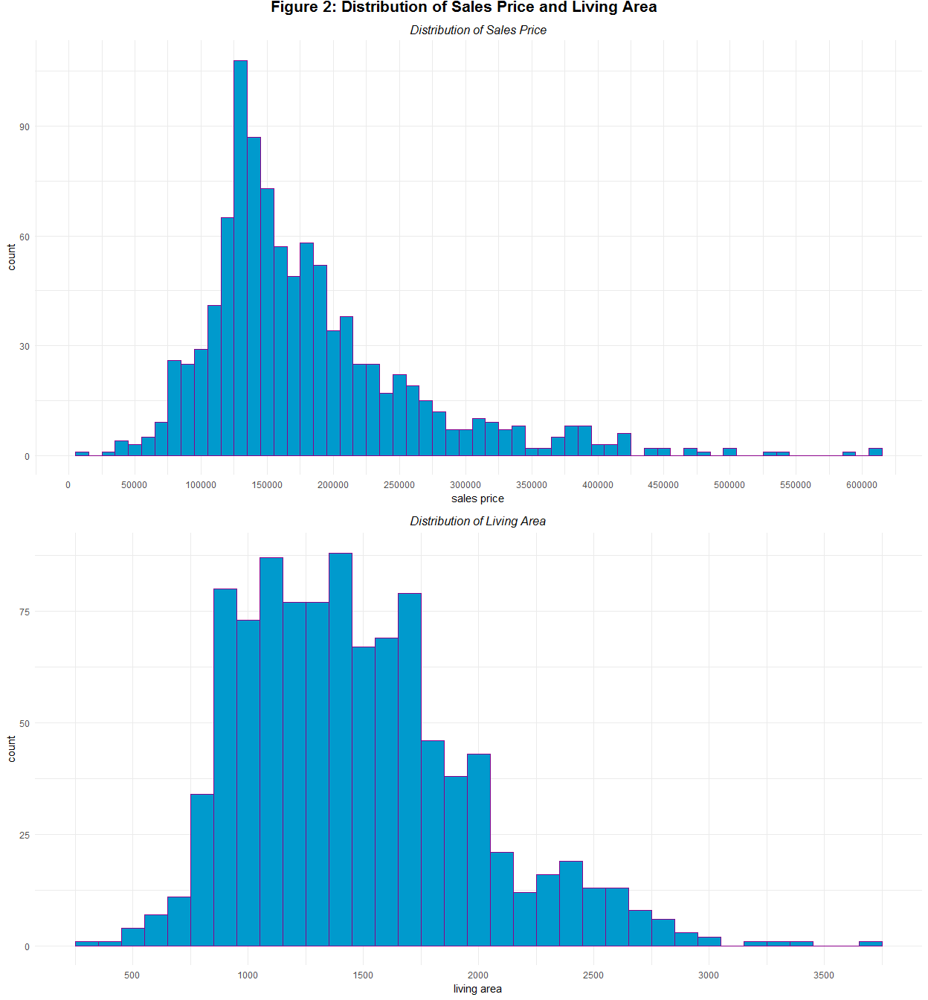
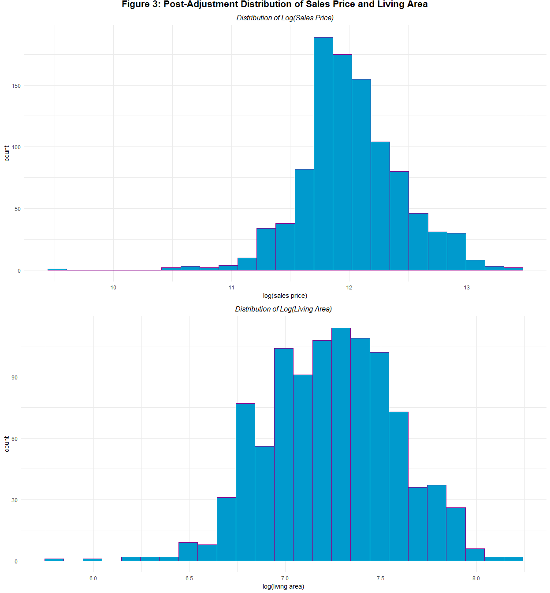
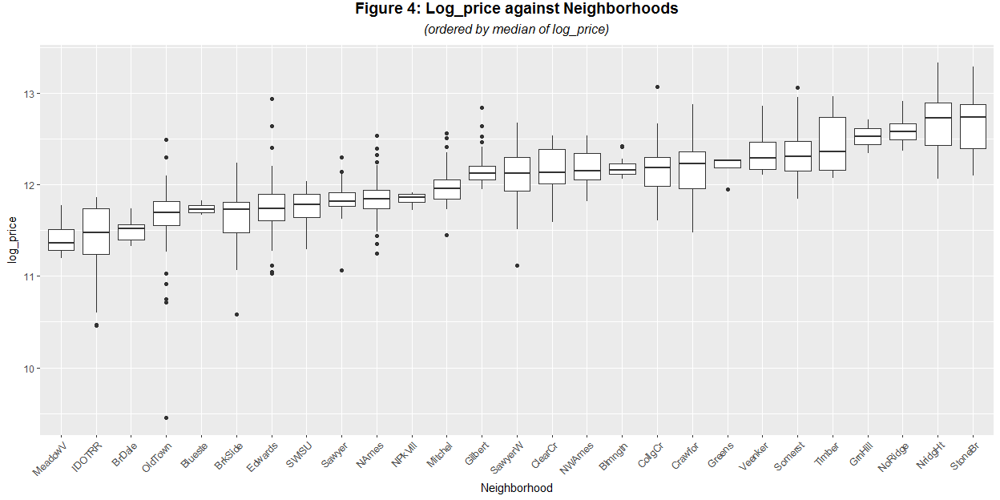
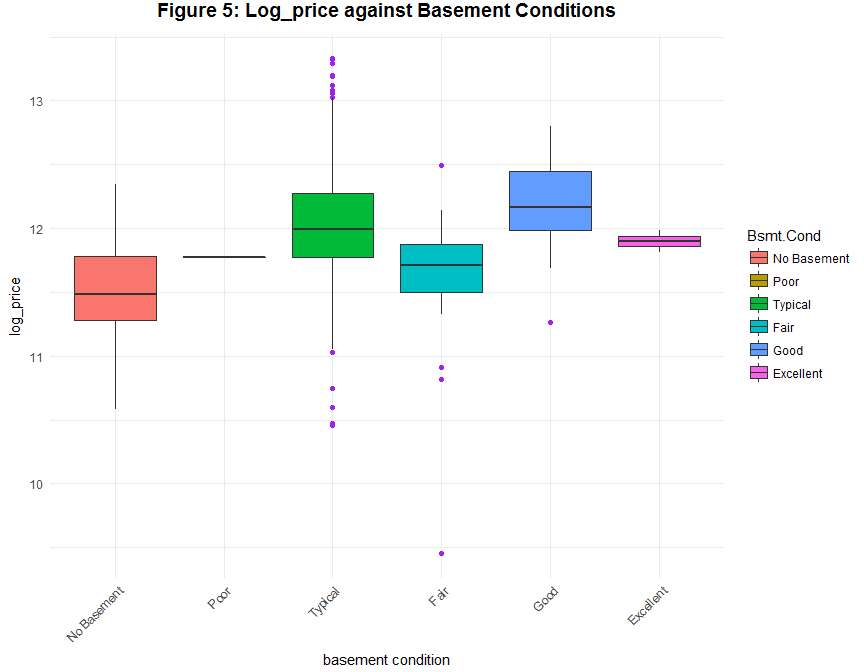

***
# Synopsis
***

This is **Part I** of the final project of the Capstone Course in the Statistics with R specialization on Coursera, which includes merely the first three sections of the whole report. In this report, I'll:

* Get the data;
* Clean the data, delete the variables with too many missing values and drop the potential outliers;
* Perform exploratory data analysis, find the likely predictors of housing price

My findings include:

* 10 variables removed (contain too many missing values or take only one value);
* 24 potential outliers removed (abnormal sales)
* Log transformation of price and area
* Two potential predictors (neighborhoods, basement conditions)

***
# Data
***

Imagine that you are a statistical consultant who has recently been hired by a real estate investment firm based in Ames, Iowa. They have had an intern collect and collate all of the recent house sales in Ames and have put together a large spreadsheet that contains the sale price of each house along with many of its physical features. 

__Your employers want you to take this data and develop a model to predict the selling price of a given home. They hope to use this information to help assess whether the asking price of a house is higher or lower than the true value of the house.__

To better assess the quality of our model, the whole data have been randomly divided into three separate data sets: a training data set, a test data set, and a validation data set. Initially we will use the training data set; the others will be used later for comparison purposes.

## Setups


```r
# set working directory
setwd("D:/My Documents/Coursera/R/Capstone")

# Load the relevant packages.
if(!require(MASS)){install.packages('MASS')}
if(!require(dplyr)){install.packages('dplyr')}
if(!require(ggplot2)){install.packages('ggplot2')}
if(!require(BAS)){install.packages('BAS')}
if(!require(GGally)){install.packages('GGally')}
if(!require(car)){install.packages('car')}
if(!require(conover.test)){install.packages('conover.test')}
if(!require(kableExtra)){install.packages('kableExtra')}
if(!require(gridExtra)){install.packages('gridExtra')}
if(!require(ggpubr)){install.packages('ggpubr')}
```

## Getting the Data

Download the data from online resources and save it as `ames_train.RData`. If you cannot access the data set automatically, please copy the url and download the data by hand. Remember to save it to your own working directory and save it with the proper name.

Load the data into our working environment.


```r
# check if the data is ready, if not, download it from the Internet
if(!file.exists("./ames_train.RData")){ 
  fileUrl <- "http://github.com/QuinninR/QuinninR-sample-analysis/blob/master/Work%20Samples/WS2/Data/ames_train.Rdata"
  download.file(fileUrl, destfile = "./ames_train.RData")
}

# load data
load('ames_train.RData')
```

## About the Data


```r
# check its dimension
dim <- dim(ames_train) # dim() output list: [count of observations (rows), number of variables (columns)]
dim
```

```
## [1] 1000   81
```

Our first target database is named as `ames_train`. Check the dimension of our data. There are **1000** observations and **81** variables. Our data is from the Ames Assessors Office. It was once used in computing assessed values for individual residential properties sold in Ames, Iowa during the period 2006-2010.

__Please take a look at the [codebook](https://ww2.amstat.org/publications/jse/v19n3/decock/datadocumentation.txt) to get a brief overview.__

***
# Data Processing
***

## Missing Values

Make a summary table of `ames_train` (for simplicity of this report, the summary table is hidden).


```r
# make a summary table
summary(ames_train)
```

Note that some variables in `ames_train` have `NA` values, we should eliminate those with too many missing values in order to ensure the efficiency of our models. Show the top 10 variables with the most `NAs` and the corresponding numbers of missing values. 


```r
# sum up missing values in each column
most_NA <- colSums(is.na(ames_train)) # creat a named list with variables as names and count of NAs as the elements 

# sort the named list by decreasing order of NAs
most_NA <- sort(most_NA, decreasing = T) # arrange the named list with descending order
  
NAs <- data.frame(Variable = names(most_NA)[1:10],
                  NAs = unname(most_NA)[1:10]) # creat a data.frame to make a summary table
NAs %>%
  kable("html") %>%
  kable_styling(position = "center")
```

<table class="table" style="margin-left: auto; margin-right: auto;">
 <thead>
  <tr>
   <th style="text-align:left;"> Variable </th>
   <th style="text-align:right;"> NAs </th>
  </tr>
 </thead>
<tbody>
  <tr>
   <td style="text-align:left;"> Pool.QC </td>
   <td style="text-align:right;"> 997 </td>
  </tr>
  <tr>
   <td style="text-align:left;"> Misc.Feature </td>
   <td style="text-align:right;"> 971 </td>
  </tr>
  <tr>
   <td style="text-align:left;"> Alley </td>
   <td style="text-align:right;"> 933 </td>
  </tr>
  <tr>
   <td style="text-align:left;"> Fence </td>
   <td style="text-align:right;"> 798 </td>
  </tr>
  <tr>
   <td style="text-align:left;"> Fireplace.Qu </td>
   <td style="text-align:right;"> 491 </td>
  </tr>
  <tr>
   <td style="text-align:left;"> Lot.Frontage </td>
   <td style="text-align:right;"> 167 </td>
  </tr>
  <tr>
   <td style="text-align:left;"> Garage.Yr.Blt </td>
   <td style="text-align:right;"> 48 </td>
  </tr>
  <tr>
   <td style="text-align:left;"> Garage.Qual </td>
   <td style="text-align:right;"> 47 </td>
  </tr>
  <tr>
   <td style="text-align:left;"> Garage.Cond </td>
   <td style="text-align:right;"> 47 </td>
  </tr>
  <tr>
   <td style="text-align:left;"> Garage.Type </td>
   <td style="text-align:right;"> 46 </td>
  </tr>
</tbody>
</table>

```r
rm(most_NA)
```

Remove `Pool.QC`, `Misc.Feature`, `Alley`, `Fence`, `Fireplace.Qu` and `Lot.Frontage`, which have over 10% of their observations missing ($>100$).

Also, remove other variables that are directly relevant to or are calculated from them, i.e. variables that take value `0` all the time given frequent missing values in `Pool.QC`, `Misc.Feature`, and `Fireplace.Qu`. These variables include `Fireplaces`, `Misc.Val`, and `Pool.Area`.

From the summary table, variable `utilities` has only one value `AllPub`, which makes it irrelevant for having any possible effects.


```r
# remove variables, select(-VarName)
ames_train <- select(ames_train,
            -Pool.QC, -Pool.Area, 
            -Misc.Feature, -Misc.Val, 
            -Alley, 
            -Fence, 
            -Fireplaces, Fireplace.Qu, 
            -Lot.Frontage, 
            -Utilities)
```

Make a table of the predictors removed in __Table 1__, with their difinitions.

Variable | Definition
-------- | ----------
Pool.QC | pool quality
Pool.Area | pool area in square feet
Misc.Feature | miscellaneous feature not covered in other categories
Misc.Val | $ value of miscellaneous feature
Alley | type of alley access to property
Fence | fence quality
Fireplaces | number of fireplaces
Fireplace.Qu | fireplace quality
Lot.Frontage | linear feet of street connected to property
Utilities | type of utilities available

Table: Table 1

## Outliers

According to special notes in the codebook: 

--------
*"There are 5 observations that an instructor may wish to remove from the data set before giving it to students. Three of them are true outliers (Partial Sales that likely don¡¯t represent actual market values) and two of them are simply unusual sales (very large houses priced relatively appropriately). I would recommend removing any houses with more than 4000 square feet from the data set (which eliminates these 5 unusual observations)"*
----------

Visualise these data points in __Figure 1__, and remove these potential outliers.


```r
ggplot(ames_train, aes(x = area, y = price)) + # set x,y variable
        geom_point(shape = 15, color = "darkmagenta", size = 1) + # use scatter plot and set shape of the data points
        theme_minimal() + # use simple background
        labs(xlab = "sales price", ylab = "living area") + # set labels for x,y axis
        ggtitle("Figure 1: Sales Price versus Living Area") + # set title
        theme(plot.title = element_text(hjust = 0.5, vjust = 3, size = 14, face = "bold")) # beautify title
```

-1.png)<!-- -->

```r
ames_train <- filter(ames_train, area < 4000)
```

Note the fan-like trend in the relationship between `price` and `area`. We expect that the distributions of both variables are somehow skewed. Plot their distributions in __Figure 2__.


```r
plot1 <- ggplot(ames_train, aes(x = price)) + 
                geom_histogram(binwidth = 10000, fill = "deepskyblue3", color="darkmagenta") +
                scale_x_continuous(name = "sales price", breaks = seq(0,650000, 50000)) + # set scale on x-axis
                ggtitle("Distribution of Sales Price") +
                theme_minimal() +
                theme(plot.title = element_text(hjust = 0.5, vjust = 1, size = 12, face = "italic"))
plot2 <- ggplot(ames_train, aes(x = area)) +
                geom_histogram(binwidth = 100, fill = "deepskyblue3", color="darkmagenta") +
                scale_x_continuous(name = "living area", breaks = seq(0, 5000, 500)) +
                ggtitle("Distribution of Living Area") + 
                theme_minimal() + 
                theme(plot.title = element_text(hjust = 0.5, vjust = 1, size = 12, face = "italic"))
        
main = text_grob("Figure 2: Distribution of Sales Price and Living Area", size = 16, face = "bold", hjust = 0.5, vjust = 0.2) # set the overall title
        
grid.arrange(plot1, plot2, nrow = 2, top = main) # arrange the plots with 2 rows and 1 column
```

<!-- -->

```r
rm(plot1, plot2, main)
```

The distributions of both `price` and `area` are right-skewed. Make summary tables for both variables.


```r
summary(ames_train$price)
```

```
##    Min. 1st Qu.  Median    Mean 3rd Qu.    Max. 
##   12789  129675  159434  181187  213000  615000
```

```r
summary(ames_train$area)
```

```
##    Min. 1st Qu.  Median    Mean 3rd Qu.    Max. 
##     334    1092    1411    1473    1742    3672
```

Note in both cases mean is larger than median, which confirms our visualization that `price` and `area` are right-skewed. Also note that both `price` and `area` are above zero. Consider transforming them into log-scale and create new variables `log_price` and `log_area` correspondingly.


```r
ames_train <- mutate(ames_train, 
                     log_price = log(price),
                     log_area = log(area))
```

Check the post-adjustment distribution in __Figure 3__.


```r
plot1 <- ggplot(ames_train, aes(x = log_price)) + 
                geom_histogram(bins = 25, fill = "deepskyblue3", color="darkmagenta") +
                xlab("log(sales price)") + 
                ggtitle("Distribution of Log(Sales Price)") +
                theme_minimal() +
                theme(plot.title = element_text(hjust = 0.5, vjust = 1, size = 12, face = "italic"))
plot2 <- ggplot(ames_train, aes(x = log_area)) +
                geom_histogram(bins = 25, fill = "deepskyblue3", color="darkmagenta") +
                xlab("log(living area)") +
                ggtitle("Distribution of Log(Living Area)") + 
                theme_minimal() + 
                theme(plot.title = element_text(hjust = 0.5, vjust = 1, size = 12, face = "italic"))
        
main = text_grob("Figure 3: Post-Adjustment Distribution of Sales Price and Living Area", size = 16, face = "bold", hjust = 0.5, vjust = 0.2)
        
grid.arrange(plot1, plot2, nrow = 2, top = main)
```

<!-- -->

```r
rm(plot1, plot2, main)
```

Check `log_price` against `log_area` in __Figure 4__.


```r
ggplot(ames_train, aes(x = log_area, y = log_price)) +
        geom_point(shape = 15, color = "darkmagenta", size = 1) + 
        theme_minimal() +
        xlab("log(sales price)") + ylab("log(living area)") + 
        ggtitle("Figure 4: Log(Sales Price) versus Log(Living Area)") + 
        theme(plot.title = element_text(hjust = 0.5, vjust = 3, size = 14, face = "bold"))
```

<!-- -->

Their relation now seems much more linear after log transformations. It was also suggested in the codebook that effective observations typically do not take abnormal values in `Sale.Condition`, i.e. are sold normally. Abnormal sales include foreclosures, adjoining land purchase, allocation, and family sales, which might make our estimates biased.

Check their frequencies and scrutinize the relationship between `log_price` and `log_area` (for illustration) conditioning on `Sale.Condition` with a panel of scatter plots in __Figure 3__.


```r
levels(ames_train$Sale.Condition) <- c("Foreclosures", "Adjoining Land Purchase", "Allocation", 'Family Sales', "Normal", "Partial")
ggplot(ames_train, aes(x=log_area, y= log_price)) + 
          geom_point(size = 1.5, shape = 3, color = "darkmagenta") + 
          xlab("log(sales price)") + ylab("log(living area)") + 
          facet_grid(.~ Sale.Condition) + # make the panel conditioned on `Sale.Condition`
          ggtitle("Figure 3: Log(Sales Price) against Log(Living Area)", subtitle="(conditioned on Sale.Condition)") + 
          theme(plot.title = element_text(hjust = 0.5, vjust = 3, size = 14, face = "bold"), 
                plot.subtitle = element_text(hjust=0.5, vjust=3, size = 12, face = "italic"))
```

<!-- -->

Note that the linear relationship appears to be consistent with the one in __Figure 2__ in the `Foreclosures`, `Normal` and `Partial` groups. Drop potential outliers with other abnormal sale conditions. 


```r
ames_train <- subset(ames_train, Sale.Condition %in% c("Normal", "Partial", "Foreclosures"))
dim <- dim(ames_train)
```

After initial data processing, there are **976** observations and **74** variables left for our analysis.

***
# Exploratory Data Analysis (detailed)
***

## Log_price versus Neiborhood

The mantra in real estate is ¡°Location, Location, Location!¡± The most likely predictor of housing price that occurs to me is the neiborhood. Make a boxplot to show the association in **Figure 4**, using median of `log_price` to measure the neighborhood sales price of houses ¡°on average¡±. Arrange the neighborhoods by descending order.


```r
# make an ordered list of the neighborhoods
log_price_neighbor <- order(as.numeric(by(ames_train$log_price, ames_train$Neighborhood, median)))

# apply the ordering
ames_train$Neighborhood <- ordered(ames_train$Neighborhood, levels=levels(ames_train$Neighborhood)[log_price_neighbor])

ggplot(ames_train, aes(y=log_price, x=Neighborhood)) +
        geom_boxplot() +
        ylab("log_price") + 
        ggtitle("Figure 4: Log_price against Neighborhoods", subtitle="(ordered by median of log_price)") +
        theme(axis.text.x = element_text(angle = 45,hjust = 1), # use inclined text on the x-axis
              plot.title = element_text(hjust = 0.5, vjust = 3, size = 14, face = "bold"), 
              plot.subtitle = element_text(hjust = 0.5, vjust = 3, size = 12, face = "italic"))
```

<!-- -->

The box plot shows how price increases across neighborhoods. By the median of `log_price` in each neiborhood, the most ¡°expensive¡± neighborhood is `Stone Brook` and the cheapest is `Meadow Village`.

To test whether the two variables are dependent, i.e. whether the median of `log_price` changes significantly  across neighborhoods, conduct a [Kruskal-Wallis test](https://en.wikipedia.org/wiki/Kruskal%E2%80%93Wallis_one-way_analysis_of_variance).

Check the assumptions of Kruskal-Wallis test first. As a non-parametric test, Kruskal-Wallis test does not assume normal distribution of each grouped population, but it assumes [homoscedasticity](https://en.wikipedia.org/wiki/Homoscedasticity). To test whether the assumption of homoscedasticity holds, use a [Levene¡¯s test](https://en.wikipedia.org/wiki/Levene%27s_test). The null hypothesis is that the standard deviations across neighborhoods are identical.


```r
leveneTest(log_price ~ Neighborhood, data = ames_train)
```

```
## Levene's Test for Homogeneity of Variance (center = median)
##        Df F value          Pr(>F)    
## group  26  3.9836 0.0000000001535 ***
##       949                            
## ---
## Signif. codes:  0 '***' 0.001 '**' 0.01 '*' 0.05 '.' 0.1 ' ' 1
```

As the test results shows, *p-value* turns out to be close to zero. Hence we reject the null hypothesis, and conclude that at least a pair of distributions of `log_price` across neighborhoods have heteroscedasticity problem, at a significance level of 5%.


```r
kruskal.test(log_price ~ Neighborhood, data = ames_train)
```

```
## 
## 	Kruskal-Wallis rank sum test
## 
## data:  log_price by Neighborhood
## Kruskal-Wallis chi-squared = 645.42, df = 26, p-value <
## 0.00000000000000022
```

As the test results shows, *p-value* again turns out to be nearly zero. Hence we reject the null hypothesis, and conclude that at a significance level of 5%, median price of houses in ames across at least two out of the 28 neiborhoods from `Meadow Village` to `Stone Brook` are non-identical populations.

However, Kruskal-Wallis test is very vulnerable to heteroscedasticity across groups. With its assumption of homoscedasticity violated, we should be really careful to apply its conclusion to our sample. It¡¯s not encouraged to further conduct a Conover-Iman test to find out which pairs of populations diverge. 

To be brief and direct, we could include `Neighborhood` in our model to predict the housing price. However we should be really careful in doing so, as long as there¡¯s no better tool, according to my knowledge, than Kruskal-Wallis test to overcome heteroscedasticity, suggested by our Levene¡¯s test, across at least one pair of distributions of `log_price` of two neighborhoods at a significance level of 5%.

## Log_price versus Basement Condition

Large houses tend to be more expensive. For houses with basements, the quality of the basements is certainly of concern. During rigid winters in North America, a nice basement can provide its residentsa warm and dry place to stay. One interesting finding of this EDA process is the association between `log_price` and  `Bsmt.Cond`, where the latter refers to ¡°Basement Condition¡±.

`Bsmt.Cond` is a categorical variable with multiple categories, extend the abbreviations and reorder the levels to present our findings better. Also, substitute the missing values with `No Basement`.


```r
# rename the levels
levels(ames_train$Bsmt.Cond) <- c("No Basement", "Excellent", "Fair", "Good",  "Poor", "Typical")

# substitute NAs
ames_train[is.na(ames_train$Bsmt.Cond), "Bsmt.Cond"] <- "No Basement"

# reorder the levels
ames_train$Bsmt.Cond <- factor(ames_train$Bsmt.Cond, levels = c("No Basement", "Poor", "Typical", "Fair", "Good", "Excellent"))
```

Make a boxplot of `log_price` against `Bsmt.Cond` in **Figure 5**


```r
ggplot(data = ames_train, aes(x = Bsmt.Cond, y = log_price, fill = Bsmt.Cond)) + # fill the box with colors conditioned on x variable to make better plot
        geom_boxplot(outlier.color = "purple") + 
        ggtitle("Figure 5: Log_price against Basement Conditions") + 
        xlab("basement condition") + ylab("log_price") + 
        theme_minimal() + 
        theme(axis.text.x = element_text(angle = 45,hjust = 1), # use inclined text on the x-axis
              plot.title = element_text(hjust = 0.5, vjust = 3, size = 14, face = "bold"))
```

<!-- -->

Our finding seems counter-intuitive that it somehow contradicts our initial guess, i.e. we cannot find a clear pattern that housing price increases with basement conditions gettig better. Like wise, use a Kruskal-Wallis test to statistically determine whether the median housing price varies across basement groups. Likewise, test the assumption of homoscedasticity first.


```r
leveneTest(log_price ~ Bsmt.Cond, data = ames_train)
```

```
## Levene's Test for Homogeneity of Variance (center = median)
##        Df F value Pr(>F)
## group   5  0.8844 0.4909
##       970
```

As the test results shows, *p-value* turns out to be large enough ($p > 0.05$). Hence we fail to reject the null hypothesis and conclude that our sample fail to provide convincing evidence to refuse the assumption of homoscedasticity that the standard deviations across basement conditions are identical. There is no significant heteroscedasticity problem in our sample.

Conditions of Kruskal-Wallis rank sum test satisfied, we can proceed to test the null hypothesis that mean ranks, or medians, are the same across basement condition groups.


```r
kruskal.test(log_price~Bsmt.Cond, data=ames_train)
```

```
## 
## 	Kruskal-Wallis rank sum test
## 
## data:  log_price by Bsmt.Cond
## Kruskal-Wallis chi-squared = 56.979, df = 5, p-value =
## 0.00000000005109
```

The reported *p-value* turns out to be nearly zero. Hence we reject the null hypothesis, and conclude that mean ranks, or medians, of `log_price` are not identical across the distributions of at least one pair of basement conditions, at a significance level of 5%. Here note that although the association is statistically significant, it's hard to observe with mere visualization. That's why statistical inference or hypothesis testing are needed for refined conclusions on the associations.

With Kruskal-Wallis's null hypothesis rejected, further conduct a [Conover-Iman test](http://permalink.lanl.gov/object/tr?what=info:lanl-repo/lareport/LA-07677-MS), with [Bonferroni correction](https://en.wikipedia.org/wiki/Bonferroni_correction) of *p-values* for multiple hypothesis testing, to find out which pairs have significantly divergent distributions.


```r
conover.test(ames_train$log_price, g = ames_train$Bsmt.Cond, method = "bonferroni", label = TRUE,  wrap = TRUE, table = TRUE)
```

```
##   Kruskal-Wallis rank sum test
## 
## data: x and group
## Kruskal-Wallis chi-squared = 56.9786, df = 5, p-value = 0
## 
## 
##                            Comparison of x by group                            
##                                  (Bonferroni)                                  
## Col Mean-|
## Row Mean |   Excellen       Fair       Good   No Basem       Poor
## ---------+-------------------------------------------------------
##     Fair |   0.771426
##          |     1.0000
##          |
##     Good |  -1.200586  -5.542136
##          |     1.0000    0.0000*
##          |
## No Basem |   1.101102   0.815467   6.300019
##          |     1.0000     1.0000    0.0000*
##          |
##     Poor |   0.448098  -0.019478   1.401144  -0.259908
##          |     1.0000     1.0000     1.0000     1.0000
##          |
##  Typical |  -0.512297  -4.409838   3.205940  -5.333161  -0.910949
##          |     1.0000    0.0001*    0.0104*    0.0000*     1.0000
## 
## alpha = 0.05
## Reject Ho if p <= alpha/2
```

From the test report above, we conclude that at a significance level of 5%, distributions of `log_price` significantly differ between paired populations of basements categorized as `Good` and `Fair`, `Good` and `No Basement`, `Good` and `Typical`, `Typical` and `Fair`, as well as `Typical` and  `No Basement`.

As a conclusion, if we are to incorporate `Bsmt.Cond` into our model to predict housing price, we should drop the categories of `Poor` and `Excellent`, as they make no significant contribution to capture the variations in `log_price`. It's might be resulted from the highly limited number of observations with poor or excellent basements. Calculate the proportion of either case in our sample separately with a user-written function `pro()`.


```r
# write the function
pro = function(x, y) {
        round(sum(x == y) / length(ames_train$PID) * 100, digits = 2)
}

# apply pro()
print(paste("The proportion of poor quality basement is: ", pro(ames_train$Bsmt.Cond, "Poor"), "%", sep = ""), quote = F)
```

```
## [1] The proportion of poor quality basement is: 0.1%
```

```r
print(paste("The proportion of excellent quality basement is: ", pro(ames_train$Bsmt.Cond, "Excellent"), "%", sep = ""), quote = F)
```

```
## [1] The proportion of excellent quality basement is: 0.2%
```

```r
# with minute proportions, drop them
ames_train <- ames_train[ames_train$Bsmt.Cond %in% c("No Basement", "Fair", "Good", "Typical"), ]
```

