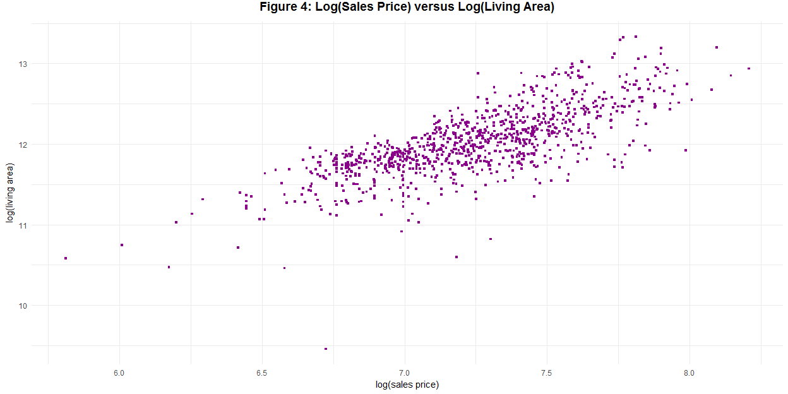
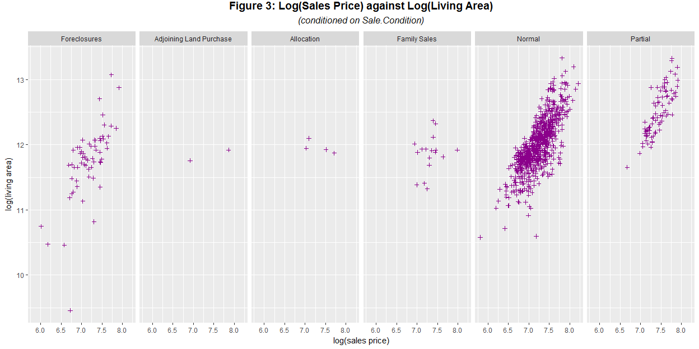

***
# Synopsis
***

***
# Data
***

Imagine that you are a statistical consultant who has recently been hired by a real estate investment firm based in Ames, Iowa. They have had an intern collect and collate all of the recent house sales in Ames and have put together a large spreadsheet that contains the sale price of each house along with many of its physical features. 

__Your employers want you to take this data and develop a model to predict the selling price of a given home. They hope to use this information to help assess whether the asking price of a house is higher or lower than the true value of the house.__

To better assess the quality of our model, the whole data have been randomly divided into three separate data sets: a training data set, a test data set, and a validation data set. Initially we will use the training data set; the others will be used later for comparison purposes.

## Setups


```r
# set working directory
setwd("D:/My Documents/Coursera/R/Capstone")

# Load the relevant packages.
if(!require(MASS)){install.packages('MASS')}
if(!require(dplyr)){install.packages('dplyr')}
if(!require(ggplot2)){install.packages('ggplot2')}
if(!require(BAS)){install.packages('BAS')}
if(!require(GGally)){install.packages('GGally')}
if(!require(car)){install.packages('car')}
if(!require(conover.test)){install.packages('conover.test')}
if(!require(kableExtra)){install.packages('kableExtra')}
if(!require(gridExtra)){install.packages('gridExtra')}
if(!require(ggpubr)){install.packages('ggpubr')}
```

## Getting the Data

Download the data from online resources and save it as `ames_train.RData`. Load it into our working environment.


```r
# check if the data is ready, if not, download it from the Internet
if(!file.exists("./ames_train.RData")){
  fileUrl <- "https://d3c33hcgiwev3.cloudfront.net/_fc6ea3b3b1af3f4fd9afb752e85d4299_ames_train.Rdata?Expires=1525305600&Signature=H0Q0p233C77y0YdcN-ULRY0~BhfE1Xk4ECNraHF3hTgA4whjBqloUvzeNgsb8n42ST9lkEn-XoGsm2IMSZWVoHU5URCOqmU-kS~bLN1jQEafcm-DzRDH-cD7rv0TFioZN9M-NMJxFL4dAWDbPC1yr5ZpAS04RHyXJGqmcndZk0Y_&Key-Pair-Id=APKAJLTNE6QMUY6HBC5A"
  download.file(fileUrl, destfile = "./ames_train.RData")
}

dateDownloaded <- date()
```

The data was downloaded on **Wed May 02 08:42:10 2018**. Then load the data into the working environment and make a cache.

## About the Data


```r
# load data
load('ames_train.RData')

# check its dimension
dim <- dim(ames_train)
dim
```

```
## [1] 1000   81
```

Our first target database is named as `ames_train`. Check the dimension of our data. There are **1000** observations and **81** variables. Our data is from the Ames Assessors Office. It was once used in computing assessed values for individual residential properties sold in Ames, Iowa during the period 2006-2010.

__Please take a look at the [codebook](https://ww2.amstat.org/publications/jse/v19n3/decock/datadocumentation.txt) to get a brief overview.__

***
# Data Processing
***

## Missing Values

Make a summary table of `ames_train` (for simplicity of this report, the summary table is hiden).


```r
# make a summary table
summary(ames_train)
```

Note that some variables in `ames_train` have `NA` values, we should eliminate those with too many missing values in order to ensure the efficiency of our models. Show the top 10 variables with the most `NAs` and the corresponding numbers of missing values. 


```r
# sum up missing values in each column
most_NA <- colSums(is.na(ames_train))

# sort the named list by decreasing order of NAs
most_NA <- sort(most_NA, decreasing = T)
  
NAs <- data.frame(Variable = names(most_NA)[1:10],
                  NAs = unname(most_NA)[1:10]) # creat a data.frame to make a summary table
NAs %>%
  kable("html") %>%
  kable_styling(position = "center")
```

<table class="table" style="margin-left: auto; margin-right: auto;">
 <thead>
  <tr>
   <th style="text-align:left;"> Variable </th>
   <th style="text-align:right;"> NAs </th>
  </tr>
 </thead>
<tbody>
  <tr>
   <td style="text-align:left;"> Pool.QC </td>
   <td style="text-align:right;"> 997 </td>
  </tr>
  <tr>
   <td style="text-align:left;"> Misc.Feature </td>
   <td style="text-align:right;"> 971 </td>
  </tr>
  <tr>
   <td style="text-align:left;"> Alley </td>
   <td style="text-align:right;"> 933 </td>
  </tr>
  <tr>
   <td style="text-align:left;"> Fence </td>
   <td style="text-align:right;"> 798 </td>
  </tr>
  <tr>
   <td style="text-align:left;"> Fireplace.Qu </td>
   <td style="text-align:right;"> 491 </td>
  </tr>
  <tr>
   <td style="text-align:left;"> Lot.Frontage </td>
   <td style="text-align:right;"> 167 </td>
  </tr>
  <tr>
   <td style="text-align:left;"> Garage.Yr.Blt </td>
   <td style="text-align:right;"> 48 </td>
  </tr>
  <tr>
   <td style="text-align:left;"> Garage.Qual </td>
   <td style="text-align:right;"> 47 </td>
  </tr>
  <tr>
   <td style="text-align:left;"> Garage.Cond </td>
   <td style="text-align:right;"> 47 </td>
  </tr>
  <tr>
   <td style="text-align:left;"> Garage.Type </td>
   <td style="text-align:right;"> 46 </td>
  </tr>
</tbody>
</table>

```r
rm(most_NA)
```

Remove `Pool.QC`, `Misc.Feature`, `Alley`, `Fence`, `Fireplace.Qu` and `Lot.Frontage`, which have over 10% of their observations missing ($>100$).

Also, remove other variables that are directly relevant to or are calculated from them, i.e. variables that take value `0` all the time given frequent missing values in `Pool.QC`, `Misc.Feature`, and `Fireplace.Qu`. These variables include `Fireplaces`, `Misc.Val`, and `Pool.Area`.

From the summary table, variable `utilities` has only one value `AllPub`, which makes it irrelevant for having any possible effects.


```r
ames_train <- ames_train %>%
     select(-Pool.QC, -Pool.Area, 
            -Misc.Feature, -Misc.Val, 
            -Alley, 
            -Fence, 
            -Fireplaces, Fireplace.Qu, 
            -Lot.Frontage, 
            -Utilities)
```

Make a table of the predictors removed in __Table 1__, with their difinitions.

Variable | Definition
-------- | ----------
Pool.QC | pool quality
Pool.Area | pool area in square feet
Misc.Feature | miscellaneous feature not covered in other categories
Misc.Val | $ value of miscellaneous feature
Alley | type of alley access to property
Fence | fence quality
Fireplaces | number of fireplaces
Fireplace.Qu | fireplace quality
Lot.Frontage | linear feet of street connected to property
Utilities | type of utilities available

Table: Table 1

## Outliers

According to special notes in the codebook: 

--------
*"There are 5 observations that an instructor may wish to remove from the data set before giving it to students. Three of them are true outliers (Partial Sales that likely don¡¯t represent actual market values) and two of them are simply unusual sales (very large houses priced relatively appropriately). I would recommend removing any houses with more than 4000 square feet from the data set (which eliminates these 5 unusual observations)"*
----------

Visualise these data points in Figure 1, and remove these potential outliers.


```r
ggplot(ames_train, aes(x = area, y = price)) + # set x,y variable
        geom_point(shape = 15, color = "darkmagenta", size = 1) + # use scatter plot and set shape of the data points
        theme_minimal() + # use simple background
        labs(xlab = "sales price", ylab = "living area") + 
        ggtitle("Figure 1: Sales Price versus Living Area") + 
        theme(plot.title = element_text(hjust = 0.5, vjust = 3, size = 14, face = "bold"))
```

-1.png)<!-- -->

```r
ames_train <- filter(ames_train, area < 4000)
```

Note the fan-like trend in the relationship between `price` and `area`. We expect that the distributions of both variables are somehow skewed. Plot their distributions in Figure 2.


```r
plot1 <- ggplot(ames_train, aes(x = price)) + 
                geom_histogram(binwidth = 10000, fill = "deepskyblue3", color="darkmagenta") +
                scale_x_continuous(name = "sales price", breaks = seq(0,650000, 50000)) + 
                ggtitle("Distribution of Sales Price") +
                theme_minimal() +
                theme(plot.title = element_text(hjust = 0.5, vjust = 1, size = 12, face = "italic"))
plot2 <- ggplot(ames_train, aes(x = area)) +
                geom_histogram(binwidth = 100, fill = "deepskyblue3", color="darkmagenta") +
                scale_x_continuous(name = "living area", breaks = seq(0, 5000, 500)) +
                ggtitle("Distribution of Living Area") + 
                theme_minimal() + 
                theme(plot.title = element_text(hjust = 0.5, vjust = 1, size = 12, face = "italic"))
        
main = text_grob("Figure 2: Distribution of Sales Price and Living Area", size = 16, face = "bold", hjust = 0.5, vjust = 0.2)
        
grid.arrange(plot1, plot2, nrow = 2, top = main)
```

<!-- -->

```r
rm(plot1, plot2, main)
```

The distributions of both `price` and `area` are right-skewed. Make summary tables for both variables.


```r
summary(ames_train$price)
```

```
##    Min. 1st Qu.  Median    Mean 3rd Qu.    Max. 
##   12789  129675  159434  181187  213000  615000
```

```r
summary(ames_train$area)
```

```
##    Min. 1st Qu.  Median    Mean 3rd Qu.    Max. 
##     334    1092    1411    1473    1742    3672
```

Note in both cases mean is larger than median, which confirms our visualization that `price` and `area` are right-skewed. Also note that both `price` and `area` are above zero. Consider transforming them into log-scale and create new variables `log_price` and `log_area` correspondingly.


```r
ames_train <- mutate(ames_train, 
                     log_price = log(price),
                     log_area = log(area))
```

Check the post-adjustment distribution in Figure 3.


```r
plot1 <- ggplot(ames_train, aes(x = log_price)) + 
                geom_histogram(bins = 25, fill = "deepskyblue3", color="darkmagenta") +
                xlab("log(sales price)") + 
                ggtitle("Distribution of Log(Sales Price)") +
                theme_minimal() +
                theme(plot.title = element_text(hjust = 0.5, vjust = 1, size = 12, face = "italic"))
plot2 <- ggplot(ames_train, aes(x = log_area)) +
                geom_histogram(bins = 25, fill = "deepskyblue3", color="darkmagenta") +
                xlab("log(living area)") +
                ggtitle("Distribution of Log(Living Area)") + 
                theme_minimal() + 
                theme(plot.title = element_text(hjust = 0.5, vjust = 1, size = 12, face = "italic"))
        
main = text_grob("Figure 3: Post-Adjustment Distribution of Sales Price and Living Area", size = 16, face = "bold", hjust = 0.5, vjust = 0.2)
        
grid.arrange(plot1, plot2, nrow = 2, top = main)
```

<!-- -->

```r
rm(plot1, plot2, main)
```

Check `log_price` against `log_area`.


```r
ggplot(ames_train, aes(x = log_area, y = log_price)) +
        geom_point(shape = 15, color = "darkmagenta", size = 1) + 
        theme_minimal() +
        xlab("log(sales price)") + ylab("log(living area)") + 
        ggtitle("Figure 2: Log(Sales Price) versus Log(Living Area)") + 
        theme(plot.title = element_text(hjust = 0.5, vjust = 3, size = 14, face = "bold"))
```

<!-- -->

Their relation now seems much more linear after log transformations. It was also suggested in the codebook that effective observations typically do not take abnormal values in `Sale.Condition`, i.e. are sold normally. Abnormal sales include foreclosures, adjoining land purchase, allocation, and family sales, which might make our estimates biased.

Check their frequencies and scrutinize the relationship between `log_price` and `log_area` (for illustration) conditioning on `Sale.Condition` with a panel of scatter plots in Figure 3.


```r
levels(ames_train$Sale.Condition) <- c("Foreclosures", "Adjoining Land Purchase", "Allocation", 'Family Sales', "Normal", "Partial")
ggplot(ames_train, aes(x=log_area, y= log_price)) + 
          geom_point(size = 1.5, shape = 3, color = "darkmagenta") + 
          xlab("log(sales price)") + ylab("log(living area)") + 
          facet_grid(.~ Sale.Condition) + # make the panel
          ggtitle("Figure 3: Log(Sales Price) against Log(Living Area)", subtitle="(conditioned on Sale.Condition)") + 
          theme(plot.title = element_text(hjust = 0.5, vjust = 3, size = 14, face = "bold"), 
                plot.subtitle = element_text(hjust=0.5, vjust=3, size = 12, face = "italic"))
```

<!-- -->

Note that the linear relationship appears to be consistent with the one in Figure 2 in the `Foreclosures`, `Normal` and `Partial` groups. Drop potential outliers with other abnormal sale conditions. 


```r
ames_train <- subset(ames_train, Sale.Condition %in% c("Normal", "Partial", "Foreclosures"))
print(paste("There are", dim(ames_train)[1], "observations and", dim(ames_train)[2], "variables after initial data processing",sep = " "), quote = FALSE)
```

```
## [1] There are 976 observations and 74 variables after initial data processing
```

