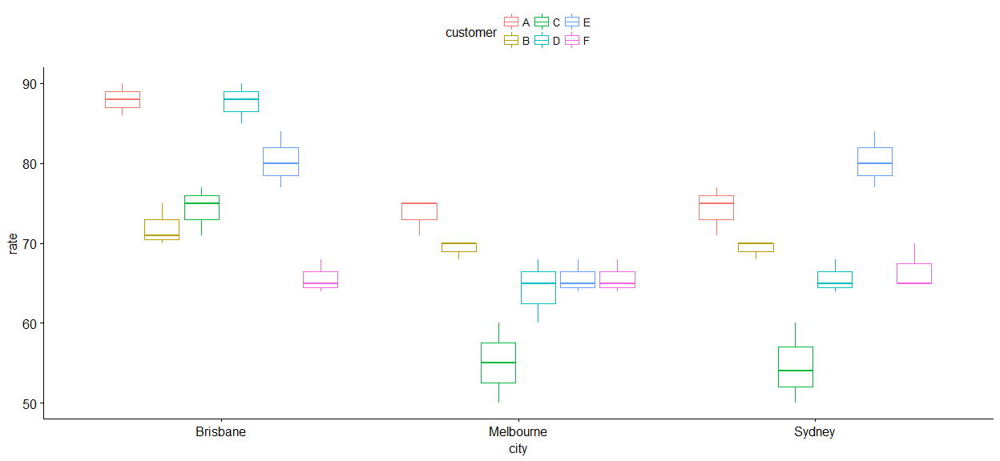
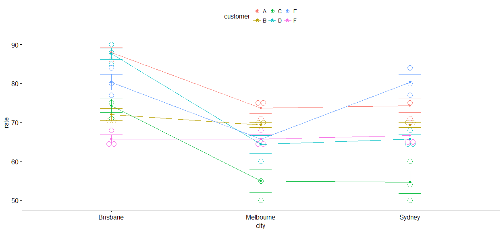
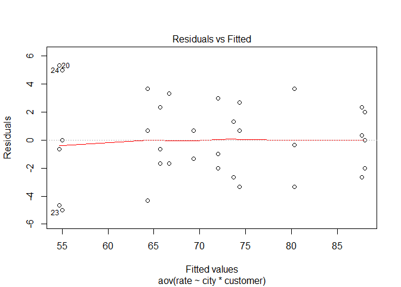
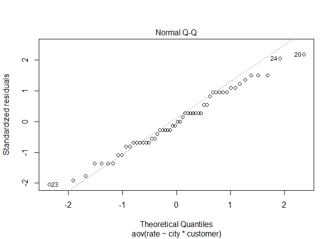

# 准备和数据处理

将数据读入工作环境并加载所需的数据处理和可视化程序包。


```r
ratings <- read.csv('ratings.csv')

if(!require(plyr)){install.packages('plyr')}
if(!require(dplyr)){install.packages('dplyr')}
if(!require(ggplot2)){install.packages('ggplot2')}
if(!require(ggpubr)){install.packages('ggpubr')}
if(!require(conover.test)){install.packages('conover.test')}
```

首先从我们的数据中随机抽取10个样本以考察数据结构。


```r
set.seed(1234)
dplyr::sample_n(ratings, 10)
```

```
##    customer rate      city
## 7         A   90  Brisbane
## 33        D   68 Melbourne
## 32        D   65 Melbourne
## 52        F   65  Brisbane
## 44        E   84  Brisbane
## 51        F   64 Melbourne
## 1         A   75    Sydney
## 11        B   68    Sydney
## 31        D   60 Melbourne
## 24        C   60 Melbourne
```

可以看到，我们想要考察的是分组变量神秘顾客身份(`customer`)和城市(`city`)对于评分(`rate`)的影响。这时首先应该考虑我们的样本是否是平衡(balanced)的。以`customer`和`city`制作列联表，考察每一类下的样本数量是否相等：如相等，则我们方差分析的对象是平衡设计(balanced design)。


```r
with(ratings, table(customer, city))
```

```
##         city
## customer Brisbane Melbourne Sydney
##        A        3         3      3
##        B        3         3      3
##        C        3         3      3
##        D        3         3      3
##        E        3         3      3
##        F        3         3      3
```

# 探索性数据分析

可以看到，我们的样本是完美平衡的。通过以`customer`为横轴变量，`city`为分组变量，`rate`为纵轴变量的箱图，我们得以初步可视化考察平均打分在城市间的组间差异和顾客个体的组内差异。


```r
ggboxplot(ratings, x = "city", y = "rate", color = "customer")
```

<!-- -->

同时，为了考察两个分组变量在影响评分的同时是否存在交互效应，我们以城市为横轴变量，得分为纵轴变量，顾客身份为追踪变量(trace variable)绘制交互效应图。


```r
ggline(ratings, x = "city", y = "rate", color = "customer",
       add = c("mean_se", "dotplot"))
```

```
## `stat_bindot()` using `bins = 30`. Pick better value with `binwidth`.
```

<!-- -->

无论是从箱图中观察到明显的平均评分差异还是交互图中交叉的线，我们都认为两个分组变量（城市和顾客身份）都会对评分产生影响。也就是说，我们预期评分因城市而产生的组间差异和因顾客产生的组内差异均显著。

# 统计分析(Two-way ANOVA for Balanced Design)

但是探索性研究所得到的结论是粗略的，我们应该进一步使用方差分析来验证这一推断。


```r
anova <- aov(rate ~ city + customer, data = ratings)
summary(anova)
```

```
##             Df Sum Sq Mean Sq F value      Pr(>F)    
## city         2   1512   756.2   24.17 0.000000067 ***
## customer     5   1795   359.1   11.47 0.000000319 ***
## Residuals   46   1440    31.3                        
## ---
## Signif. codes:  0 '***' 0.001 '**' 0.01 '*' 0.05 '.' 0.1 ' ' 1
```

从上面的方差分析结果中，我们可以发现顾客评分同时受到分组变量城市和顾客身份的影响，更严谨地说，顾客评分均值在由城市和顾客身份交叉界定的分组中的至少两组间存在差异。

当然，我们借由交互图发现分组变量间可能有交互效应，所以应在线性模型中考虑交互效应。


```r
anova2 <- aov(rate ~ city*customer, data = ratings)
summary(anova2)
```

```
##               Df Sum Sq Mean Sq F value             Pr(>F)    
## city           2   1512   756.2   84.55 0.0000000000000250 ***
## customer       5   1795   359.1   40.14 0.0000000000000953 ***
## city:customer 10   1118   111.8   12.49 0.0000000055531288 ***
## Residuals     36    322     8.9                               
## ---
## Signif. codes:  0 '***' 0.001 '**' 0.01 '*' 0.05 '.' 0.1 ' ' 1
```

不难发现，在0.05的显著性水平下，分组变量和其交互均对评分有显著的影响。这也进一步说明了城市对于评分的效应受到顾客的影响，也就是说，顾客的主观判断会影响其评分，评分并不完全由各城市星巴克的水平差异决定。

# 后验：逐组比较以及方差分析假设检验

## 逐组比较

但是方差分析仅揭示了组间均值差异的存在，并没有说明在哪些组之间不同。为了探究这个，我们使用Tukey Honest Significant Differences。


```r
TukeyHSD(anova2, which = "city")
```

```
##   Tukey multiple comparisons of means
##     95% family-wise confidence level
## 
## Fit: aov(formula = rate ~ city * customer, data = ratings)
## 
## $city
##                          diff         lwr       upr     p adj
## Melbourne-Brisbane -12.388889 -14.8256302 -9.952148 0.0000000
## Sydney-Brisbane     -9.500000 -11.9367413 -7.063259 0.0000000
## Sydney-Melbourne     2.888889   0.4521476  5.325630 0.0170733
```

这种方法在考虑顾客的组内差异和两个分组变量的交互效应的前提下，对各城市的评分均值进行两两比较。**此时我们发现悉尼和布里斯班，墨尔本和布里斯班评分均值有显著差异，且墨尔本和悉尼星巴克的得分均低于布里斯班。**

__注意我们同时进行了三个假设检验，多重假设检验应该对$p-value$进行修正。此处我们使用[Bonferroni correction](https://en.wikipedia.org/wiki/Bonferroni_correction)方法校正，即将原$p$值乘以假设检验个数得到新的p值。__

**悉尼和墨尔本的组间差异$p$值校正后超过0.05，判断悉尼和墨尔本的评分之间没有显著差异（当然可能归因于Bonferroni correction过于保守）。**

采用同样的方法分析平均评分因顾客身份的组间差异。


```r
TukeyHSD(anova2, which = "customer")
```

```
##   Tukey multiple comparisons of means
##     95% family-wise confidence level
## 
## Fit: aov(formula = rate ~ city * customer, data = ratings)
## 
## $customer
##           diff         lwr          upr     p adj
## B-A  -8.444444 -12.6860593  -4.20282962 0.0000102
## C-A -17.333333 -21.5749482 -13.09171850 0.0000000
## D-A  -6.111111 -10.3527259  -1.86949628 0.0014620
## E-A  -3.222222  -7.4638371   1.01939261 0.2262870
## F-A -12.666667 -16.9082815  -8.42505184 0.0000000
## C-B  -8.888889 -13.1305037  -4.64727406 0.0000039
## D-B   2.333333  -1.9082815   6.57494816 0.5690490
## E-B   5.222222   0.9806074   9.46383705 0.0085583
## F-B  -4.222222  -8.4638371   0.01939261 0.0516396
## D-C  11.222222   6.9806074  15.46383705 0.0000000
## E-C  14.111111   9.8694963  18.35272594 0.0000000
## F-C   4.666667   0.4250518   8.90828150 0.0239713
## E-D   2.888889  -1.3527259   7.13050372 0.3360457
## F-D  -6.555556 -10.7971704  -2.31394073 0.0005817
## F-E  -9.444444 -13.6860593  -5.20282962 0.0000012
```

通过上表，$p$值校正后发现：

* 神秘顾客1的评分显著高于除了神秘顾客5以外的其他顾客；
* 神秘顾客2的评分仅显著高于神秘顾客3，与神秘顾客4和5没有显著差异；
* 神秘顾客4的评分显著高于神秘顾客6；
* 神秘顾客5的评分显著高于神秘顾客6

## 方差分析假设检验

最后对方差分析的假设进行检验，以检验我们分析的内部效度。

首先检验方差齐性，应采用[Levene’s test](https://en.wikipedia.org/wiki/Levene%27s_test)。


```r
library(car)
leveneTest(rate ~ city*customer, data = ratings)
```

```
## Levene's Test for Homogeneity of Variance (center = median)
##       Df F value Pr(>F)
## group 17  0.4286 0.9677
##       36
```

__此时Levene检验的结果不显著，说明各组方差没有显著差异，齐方差性假设在0.05显著度下没有被违背。__

同时也可以采用可视化方法检查。


```r
plot(anova2, 1)
```

<!-- -->

样本中共有三个观察被检出为异常值，分别为观察值20, 23和24。提取出这些观察值进行观察。


```r
ratings[c(20, 23, 24),]
```

```
##    customer rate      city
## 20        C   60    Sydney
## 23        C   50 Melbourne
## 24        C   60 Melbourne
```

__我们发现这些是神秘顾客3对悉尼和墨尔本的两次打分，为了获得更好的分析效果，我们应考虑删去这三个异常值。__

再进一步分析正态分布假设是否成立，首先采用Q-Q图可视化。


```r
plot(anova2, 2)
```

<!-- -->

类似地，我们检出同样的三个异常值（观察值20, 23和24），但总体数据基本符合正态分布。

最后，可以进一步使用Shapiro-Wilk test检验我们方差分析的残差。


```r
residuals <- residuals(object = anova2)

shapiro.test(x = residuals)
```

```
## 
## 	Shapiro-Wilk normality test
## 
## data:  residuals
## W = 0.98265, p-value = 0.6197
```

__检验结果不显著，正态分布假设在0.05显著度下没有被违背。__

__最后，由于两个分组变量界定的各组中观察值数量均小于5（为3），不满足样本独立性假设。以上分析可能无效。__

# 结论

**不同神秘顾客对不同城市的评分有显著差异。方差分析假设中，方差齐性和正态分布性假设成立，但样本独立性假设不成立，方差分析可能无效。**
