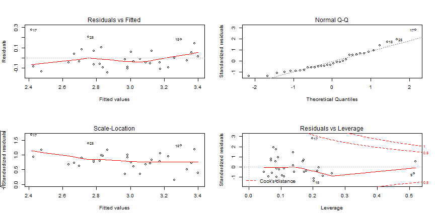
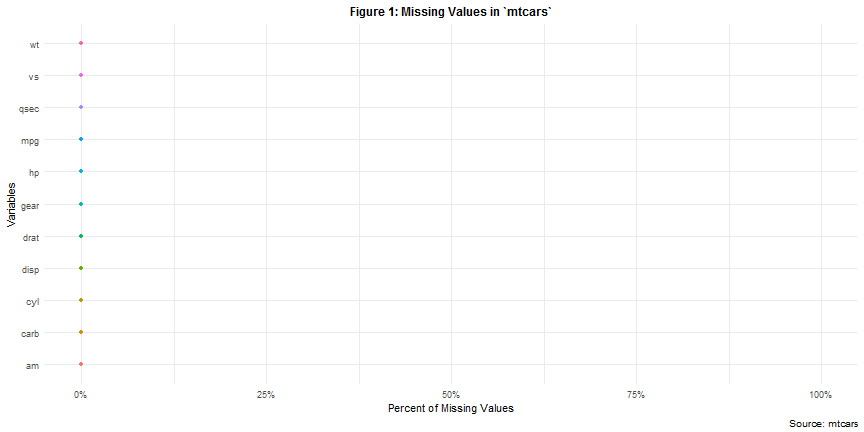
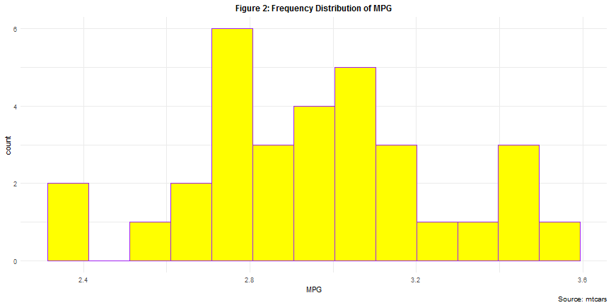
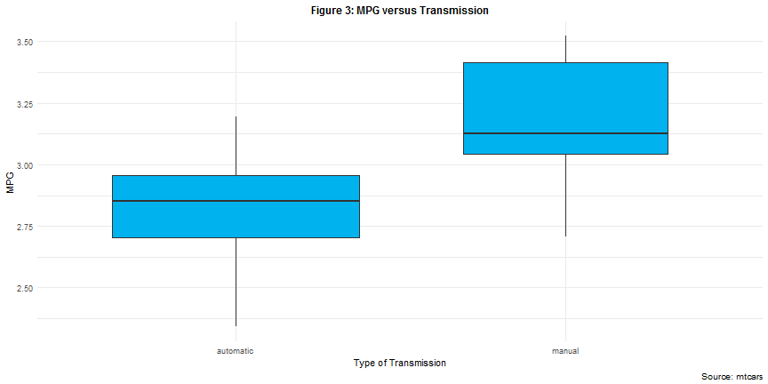
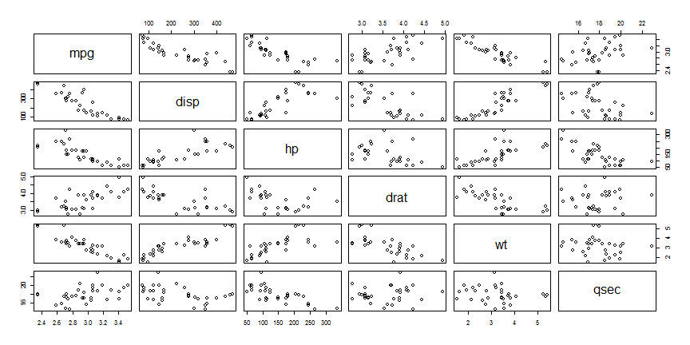

# Executive Summary

This report is an analysis based on the `mtcars` data set. The data was retrieved from the *1974 Motor Trend US* magazine, and covers fuel consumptions and ten other aspects of the design and performance of 32 automobiles (1973¨C1974 models). This report mainly attempts to address two issues:

* Is an automatic or manual transmission better for cutting MPG (miles per gallon)
* Quantify the MPG difference between automatic and manual transmissions

# Data Processing

Load the data into our working environment and chech the data structure with the first three observations.


```r
data(mtcars)
head(mtcars, n = 3)
```

```
##                mpg cyl disp  hp drat    wt  qsec vs am gear carb
## Mazda RX4     21.0   6  160 110 3.90 2.620 16.46  0  1    4    4
## Mazda RX4 Wag 21.0   6  160 110 3.90 2.875 17.02  0  1    4    4
## Datsun 710    22.8   4  108  93 3.85 2.320 18.61  1  1    4    1
```

Type of transmission is denoted by `am`, where 0 indicates automatic transmissions and 1 denotes the manual ones. `vs` implies type of the engine, while 0 refers to V-shaped ones and 1 for the straights ones. Transfer both numerical varaibles into factors and label them with meaningful labels. Also group the data with `am` and calculate the average `mpg` in both groups respectively.


```r
if(!require(dplyr)){install.packages('dplyr')}

mtcars <- mutate(mtcars, 
                 vs = factor(vs, labels = c("V", "S")),
                 am = factor(am, labels = c("automatic", "manual")))
mtcars %>%
        group_by(am) %>%
        summarise(mean = mean(mpg))
```

```
## # A tibble: 2 x 2
##   am         mean
##   <fct>     <dbl>
## 1 automatic  17.1
## 2 manual     24.4
```

We observe a larger mean in the manual group. To make this report concise, further exploratory data analysis is attached to the appendix.

# Statistical Inference

Test the null hypothesis $H_0:$ it is equally likely that a randomly selected value of miles per gallon from the automatic transmission group will be less than or greater than a randomly selected value from the automatic transmission group via the Mann¨CWhitney U test. Unlike its parametric counterparts, this test is non-parametric does not require the assumption of normal distributions. 

Note that with prior EDA, we set the alternative hypothesis as it is more likely to randomly observe a larger `mpg` in the manual transmission group.


```r
wilcox.test(mpg~am, data = mtcars, alternative = "less") 
```

```
## 
## 	Wilcoxon rank sum test with continuity correction
## 
## data:  mpg by am
## W = 42, p-value = 0.0009357
## alternative hypothesis: true location shift is less than 0
```

Since the $p-value$ is less than 0.001, we can conclude that under a significance level of 0.05, automatic transmission is better for cutting miles per gallon for the 1973¨C1974 models.

# Modelling

Start with a full model (`fit.full`). Perform model selection with both backward stepwise AIC (`back.aic`) and backward stepwise BIC (`back.bic`). Compare the resulting models by listing the regressors of both.


```r
mtcars <- mutate(mtcars, mpg = log(mpg)) 
fit.full <- lm(mpg ~ ., data = mtcars)

back.aic <- step(fit.full, direction = "backward", k = 2, trace = 0)
back.bic <- step(fit.full, direction = "backward", k = log(32), trace = 0)

matrix(c(variable.names(back.aic)[-1], variable.names(back.bic)[-1]),
       nrow = 2)
```

```
##      [,1] [,2]   [,3]
## [1,] "hp" "qsec" "hp"
## [2,] "wt" "gear" "wt"
```

The resluting models of stepwise AIC and BIC are the same. With miles per gallon as the outcome, type of transmission, weight and time per 1/4 mile as covariates. 

Make a coefficients table of our final model (`fit.final`). 


```r
fit.final <- lm(mpg ~ wt + am + qsec, data = mtcars)
summary(fit.final)$coefficients
```

```
##                Estimate Std. Error   t value          Pr(>|t|)
## (Intercept)  2.69409612 0.31326457  8.600066 0.000000002404351
## wt          -0.22455989 0.03201254 -7.014747 0.000000125153073
## ammanual     0.08557580 0.06350751  1.347491 0.188625518626582
## qsec         0.05328768 0.01299357  4.101081 0.000320262664247
```

With $p-value = 0.046$, we can conclude that at a significance level of 0.05 and ceteris paribus, miles per gallon of the manual transmission automobiles are 2.93 higher than the automatic transmission ones, on average.

Perform some residual diagnostics.


```r
par(mfrow = c(2, 2))
plot(back.aic)
```

<!-- -->

With the `residual/standard residuals versus fitted values` plots, we caanot observe any apparent pattern. With the `Normal Q-Q` plot, MPG is approximately normally distributed. With the `residuals versus leverage` plot, we see no influential points with high leverage in our data.

# Conclusions

Based on our analysis, we can conclude that:

* Automatic transmission is better for MPG;
* Cetris paribus, MPG of manual transmission automobiles are 2.93 higher than automatic ones, on average

Special Notes:

* AIC and BIC criteria can be misleading sometimes and likelihood ratio tests on nested models are suggested for a refined model selection;
* Please refer to the appendix for analysis on missing values and further exploratory data analysis

# Appendix: Exploratory Data Analysis


```r
if(!require(naniar)){install.packages('naniar')}
if(!require(ggplot2)){install.packages('ggplot2')}

gg_miss_var(mtcars) + 
        labs(y = "Percent of Missing Values",
             x = "Variables",
             title = "Figure 1: Missing Values in `mtcars`",
             caption = "Source: mtcars") +
        scale_y_continuous(limits = c(0, 1), labels = scales::percent) + 
        theme(plot.title = element_text(hjust = 0.5, vjust = 1, size = 12, face = "bold"))
```

<!-- -->


```r
ggplot(mtcars, aes(mpg)) +
        geom_histogram(fill = "yellow", color = "purple", bins = 13) + 
        labs(x = "MPG", title = "Figure 2: Frequency Distribution of MPG", caption = "Source: mtcars") +
        theme_minimal() + 
        theme(plot.title = element_text(hjust = 0.5, vjust = 1, size = 12, face = "bold"))
```

<!-- -->


```r
ggplot(mtcars, aes(y = mpg, x = am)) +
        geom_boxplot(fill = "deepskyblue2", varwidth = T) + 
        labs(x = "Type of Transmission", y = "MPG", title = "Figure 3: MPG versus Transmission", caption = "Source: mtcars") + 
        theme_minimal() +
        theme(plot.title = element_text(hjust = 0.5, vjust = 1, size = 12, face = "bold"))
```

<!-- -->

**Figure 4** presents the correlation among numerical variables in the `mtcars` data set.

<!-- -->
