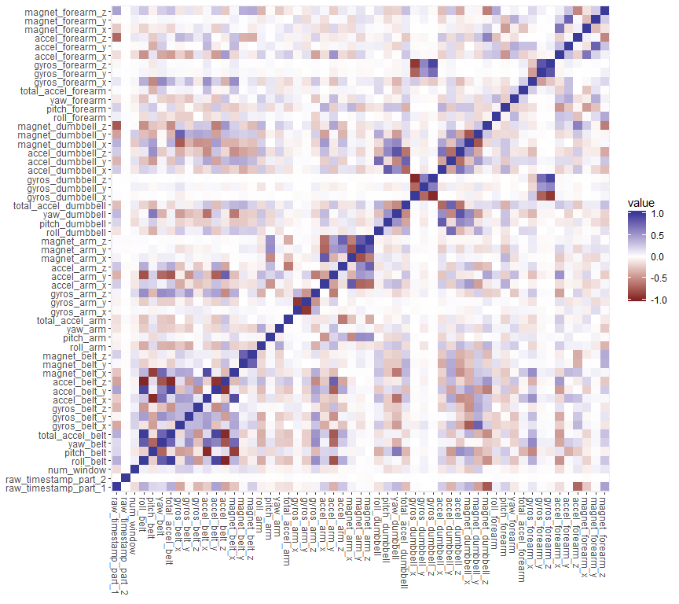

# Executive Summary

One thing that people regularly do, using devices such as *Jawbone Up*, *Nike FuelBand*, and *Fitbit* to take measurements of their activities regularly, is to quantify how much of a particular activity they do, but they rarely quantify how well they do it.

In this project, my goal will be using data from accelerometers on the belt, forearm, arm, and dumbell of 6 participants, who were asked to perform barbell lifts correctly and incorrectly in 5 different ways, to predict the manner in which they did the exercise. I apply random forest algorithm using 7-fold cross validation and get my final model with only 0.002 out-of-sample error rate.

The data was from the *Weight Lifting Exercise Dataset*^[Velloso, E.; Bulling, A.; Gellersen, H.; Ugulino, W.; Fuks, H. Qualitative Activity Recognition of Weight Lifting Exercises. Proceedings of 4th International Conference in Cooperation with SIGCHI (Augmented Human '13) . Stuttgart, Germany: ACM SIGCHI, 2013.].

# Getting the Data

Load relevant packages first.


```r
if(!require(caret)){install.packages('caret')}
if(!require(dplyr)){install.packages('dplyr')}
if(!require(ggplot2)){install.packages('ggplot2')}
if(!require(reshape2)){install.packages('reshape2')}
if(!require(randomForest)){install.packages('randomForest')}
if(!require(rattle)){install.packages('rattle')}
```

Get data from the *Human Activity Recognition* open source data^[Accessed at http://web.archive.org/web/20161224072740/http:/groupware.les.inf.puc-rio.br/har.].


```r
# get train data set
setwd('D:/My Documents/Coursera/Data Science/Machine Learning')
if(!file.exists("pml-training.csv")){
  fileUrl <- "https://d396qusza40orc.cloudfront.net/predmachlearn/pml-training.csv"
  download.file(fileUrl, destfile = "pml-training.csv")
}
train <- read.csv("pml-training.csv", header = T, na.strings = c("", "NA"))

# get test data set
if(!file.exists("pml-testing.csv")){
  fileUrl <- "https://d396qusza40orc.cloudfront.net/predmachlearn/pml-testing.csv"
  download.file(fileUrl, destfile = "pml-testing.csv")
  dateDownloaded <- date()
}
test <- read.csv("pml-testing.csv", header = T, na.strings = c("", "NA"))
```

The data was downloaded on *22 June 2018*.

# Data Pre-processing

First remove all the columns that contains missing values.


```r
train <- train[, colSums(is.na(train)) == 0]
test <- test[, colSums(is.na(test)) == 0]
```

Then check the predictors with zero or near zero variance, which would only have very limited contribution to explaining our dependent variable. Also remove the following variables in Table 1 from further modeling.

Variable | Definition
-------- | -------
X | row number of the record
new_window | indicator for summary variables row
user_name | the subject's name 

Table: Table 1


```r
# drop near zero variance predictor(s) 
traindrop <- colnames(train[nearZeroVar(train, saveMetrics=TRUE)$nzv == T])
train <-  train[, !colnames(train) %in% traindrop]
test <-  test[, !colnames(test) %in% traindrop]

Drops <- c('X', 'new_window', 'user_name')
train <-  train[, !colnames(train) %in% Drops]
test <-  test[, !colnames(test) %in% Drops]
```

Also, remove the variables that are related to the time point for recording, which is specific to the train data set and can harm our out of sample accuracy. 


```r
otherDrops <- "^timestamp|window"
trainRemove <- grepl(otherDrops, names(train))
testRemove <- grepl(otherDrops, names(test))

train <-  train[, !colnames(train) %in% otherDrops]
test <-  test[, !colnames(test) %in% otherDrops]
```

Check the correlations between numberical predictors. 


```r
cor <- melt(cor(train[sapply(train, is.numeric)]))
qplot(x = Var1, y = Var2, data = cor, fill = value, geom = "tile") +
        scale_fill_gradient2(limits = c(-1, 1)) +
        theme(axis.text.x = element_text(angle=-90, vjust=0.5, hjust=0)) + 
        labs(x = NULL, y = NULL)
```

<!-- -->

There seems to be strong correlation among variables in the bottom left. Remove variables with a correlation coefficient over 0.9.


```r
high_cor <- findCorrelation(cor(train[sapply(train, is.numeric)]), cutoff = .9)

train <- train[, -high_cor]
test <- test[-high_cor]
```

Slice the train data with 70% as train set and 30% as test set for cross validation.


```r
set.seed(9999)

inTrain <- createDataPartition(y = train$classe, p = 0.7, list=FALSE)
trainSet <- train[inTrain, ]
testSet <- train[-inTrain, ]
```

# Modeling

Use random forest algorithm with seven-fold cross validation as our initial modeling method.


```r
control <- trainControl(method="cv", 7)
fit <- train(classe ~ ., data = trainSet, method = "rf", trControl = control, ntree = 250)
fit
```

```
## Random Forest 
## 
## 13737 samples
##    49 predictor
##     5 classes: 'A', 'B', 'C', 'D', 'E' 
## 
## No pre-processing
## Resampling: Cross-Validated (7 fold) 
## Summary of sample sizes: 11775, 11776, 11775, 11773, 11775, 11774, ... 
## Resampling results across tuning parameters:
## 
##   mtry  Accuracy   Kappa    
##    2    0.9867512  0.9832386
##   34    0.9973793  0.9966851
##   67    0.9965058  0.9955805
## 
## Accuracy was used to select the optimal model using the largest value.
## The final value used for the model was mtry = 34.
```

Predict our random forest models on the test data from our original train data and compute the out-of-sample error rate.


```r
pred <- predict(fit, testSet)
confusionMatrix(pred, testSet$classe)
```

```
## Confusion Matrix and Statistics
## 
##           Reference
## Prediction    A    B    C    D    E
##          A 1674    3    0    0    0
##          B    0 1136    0    0    0
##          C    0    0 1022    1    0
##          D    0    0    4  960    1
##          E    0    0    0    3 1081
## 
## Overall Statistics
##                                                
##                Accuracy : 0.998                
##                  95% CI : (0.9964, 0.9989)     
##     No Information Rate : 0.2845               
##     P-Value [Acc > NIR] : < 0.00000000000000022
##                                                
##                   Kappa : 0.9974               
##  Mcnemar's Test P-Value : NA                   
## 
## Statistics by Class:
## 
##                      Class: A Class: B Class: C Class: D Class: E
## Sensitivity            1.0000   0.9974   0.9961   0.9959   0.9991
## Specificity            0.9993   1.0000   0.9998   0.9990   0.9994
## Pos Pred Value         0.9982   1.0000   0.9990   0.9948   0.9972
## Neg Pred Value         1.0000   0.9994   0.9992   0.9992   0.9998
## Prevalence             0.2845   0.1935   0.1743   0.1638   0.1839
## Detection Rate         0.2845   0.1930   0.1737   0.1631   0.1837
## Detection Prevalence   0.2850   0.1930   0.1738   0.1640   0.1842
## Balanced Accuracy      0.9996   0.9987   0.9979   0.9974   0.9992
```

The out-of-sample error rate for the cross-validation process is 0.998 and the out-of-sample error rate is only 0.002, which is pretty competitive. Use the model as our final model.

# Prediction

Predict on the original test data set and print the result.


```r
pred.val <- predict(fit, test)
pred.val
```

```
##  [1] B A B A A E D B A A B C B A E E A B B B
## Levels: A B C D E
```

Appendix
=====================================

Visualize classification tree from CART algorithm.


```r
modfit_tree <- train(classe ~ ., method="rpart", data=trainSet)
fancyRpartPlot(modfit_tree$finalModel)
```

<!-- -->

