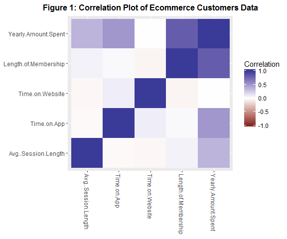
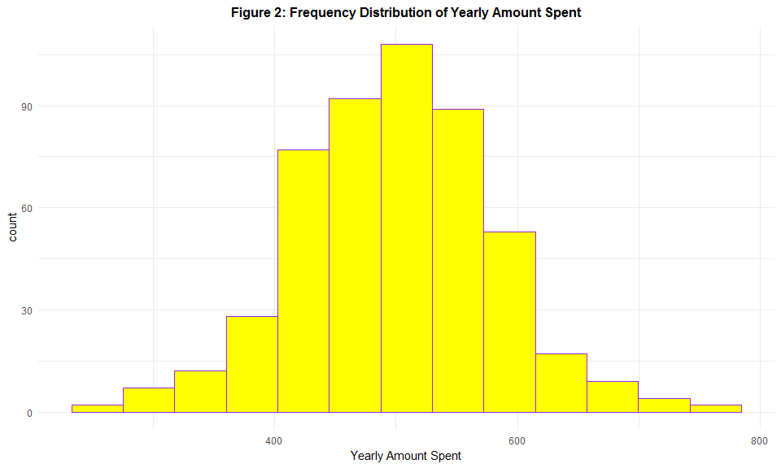
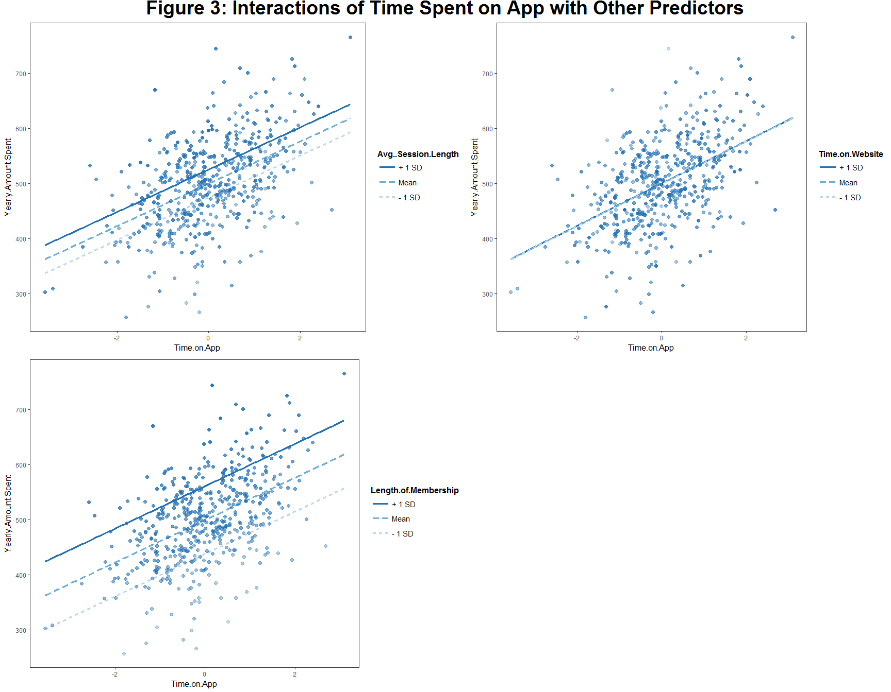
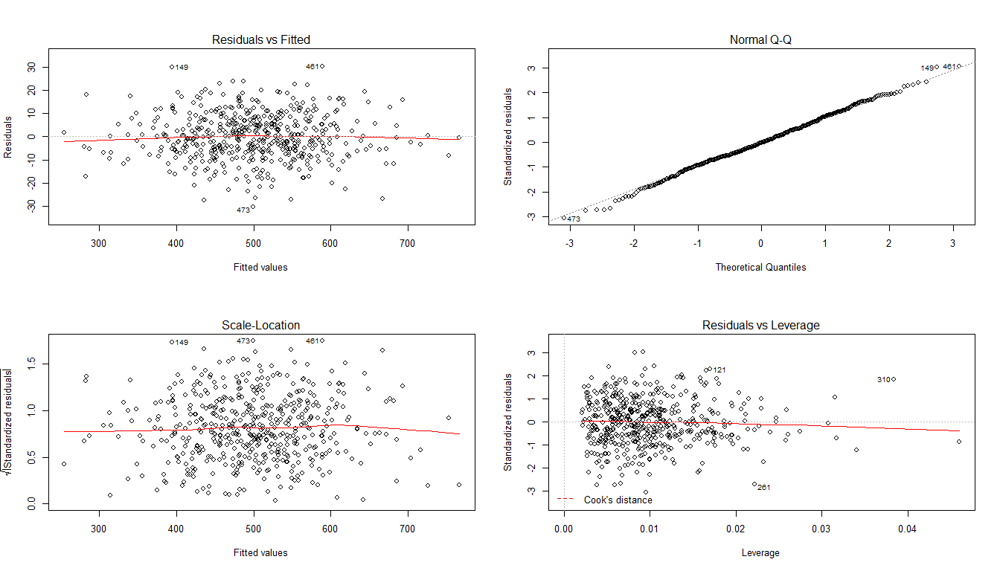

# Synopsis

This report is an analysis based on the `Ecommerce Customers` data set. It attempts to estimate and compare the effects of time spent on APP and website on customers' yearly spends, to help the company decide whether to focus their efforts on their mobile app experience or their website. 

Main findings of this paper includes: 

* Ceteris paribus, a one standard deviation increase in time spent on App is associated with a $38.5 increase in yearly amount spent, on average;
* The effect of time spent on website on the yearly amount spent is not significant

As a final conclusion, the company should focus their efforts on improving their mobile app experience, rather than their websites.

# Data Pre-pocessing


```r
# load packages
if(!require(reshape2)){install.packages('reshape2')}
if(!require(ggplot2)){install.packages('ggplot2')}
if(!require(dplyr)){install.packages('dplyr')}
if(!require(jtools)){install.packages('jtools')}
if(!require(gridExtra)){install.packages('gridExtra')}
if(!require(ggpubr)){install.packages('ggpubr')}
```


```r
# set working directory
setwd("D:/My Documents/Senior Year/Business Data Science/exam")

# load data
customers <- read.csv("Ecommerce Customers.csv")
```

An Ecommerce company sells clothing online, also has in-store style and clothing advice sessions. Customers come in to the store, have sessions/meetings with a personal stylist, then they can go home and order either on a mobile app or website for the clothes they want. The dataset has Customer info, such as Email, Address, and their color Avatar. It also includes some numerical variables:

Variable | Definition
-------- | -------
Avg.Session.Length | Average sessions of in-store style advice sessions
Time.on.App | Average time spent on App in minutes
Time.on.Website | Average time spent on Website in minutes
Length.of.Membership | How many years the customers has been a member

Table: Vriables and Definitions

Check the missing values and remove all columns with NA values. Also, Email, Address and Avatar colors are irrelevant to our issue of interest, so remove those columns from further analysis.


```r
# remove colunms with missing values
customers <- customers[, colSums(is.na(customers)) == 0]

# remove the irrelevant predictors
customers[, c('Email', 'Address', 'Avatar')] <- NULL
```

For further analysis and comparisons, standardize average session length, time on APP and website. 


```r
customers[, 1:3] <- scale(customers[, 1:3])
```

# Exploratory Data Analysis

Visualize the correlation among our remaining numerical variables. Note that there seems to be strong positive correlation between length of membersip and yearly amount spent. Also, time spent on APP and average session length somewhat affect the yearly amount spent.


```r
cor <- melt(cor(customers[sapply(customers, is.numeric)]))
qplot(x = Var1, y = Var2, data = cor, fill = value, geom = "tile") +
        scale_fill_gradient2(limits = c(-1, 1), name = "Correlation") +
        theme(axis.text.x = element_text(angle=-90, vjust=0.5, hjust=0),
              plot.title = element_text(hjust = 0.5, vjust = 1, size = 12, face = "bold")) +
        labs(x = NULL, y = NULL) + 
        ggtitle("Figure 1: Correlation Plot of Ecommerce Customers Data")
```

<!-- -->

Check the distribution of yearly amount spent.


```r
ggplot(customers, aes(Yearly.Amount.Spent)) +
        geom_histogram(fill = "yellow", color = "purple", bins = 13) + 
        labs(x = "Yearly Amount Spent", 
             title = "Figure 2: Frequency Distribution of Yearly Amount Spent") +
        theme_minimal() + 
        theme(plot.title = element_text(hjust = 0.5, vjust = 1, size = 12, face = "bold"))
```

<!-- -->

The distribution of `Yearly.Amount.Spent` is nearly normal. No need for log transformation.

# Modeling

Use a multivairable linear regression model to estimate the effects of time spent on APP and website on the yearly amount spent. Start from a full model.


```r
full.fit <- lm(Yearly.Amount.Spent ~ ., data = customers)
summary(full.fit)
```

```
## 
## Call:
## lm(formula = Yearly.Amount.Spent ~ ., data = customers)
## 
## Residuals:
##      Min       1Q   Median       3Q      Max 
## -30.4059  -6.2191  -0.1364   6.6048  30.3085 
## 
## Coefficients:
##                      Estimate Std. Error t value Pr(>|t|)    
## (Intercept)          281.7329     1.6458 171.186   <2e-16 ***
## Avg..Session.Length   25.5429     0.4477  57.057   <2e-16 ***
## Time.on.App           38.4852     0.4484  85.828   <2e-16 ***
## Time.on.Website        0.4413     0.4488   0.983    0.326    
## Length.of.Membership  61.5773     0.4483 137.346   <2e-16 ***
## ---
## Signif. codes:  0 '***' 0.001 '**' 0.01 '*' 0.05 '.' 0.1 ' ' 1
## 
## Residual standard error: 9.973 on 495 degrees of freedom
## Multiple R-squared:  0.9843,	Adjusted R-squared:  0.9842 
## F-statistic:  7766 on 4 and 495 DF,  p-value: < 2.2e-16
```

At a significance of 0.05, the effct of `Time.on.App` is the only significant main effect, while the effect of `Time.on.Website` is not significantly different from zero, ceteris paribus. 

As a further interpretation:

__Ceteris paribus, a one standard deviation increase in time spent on App is associated with a $38.5 increase in yearly amount spent, on average. By contrast, the effect of time spent on website on the yearly amount spent is not significant.__

Plot the interactions between `Time.on.App` and other explanatory variables.


```r
plot1 <- interact_plot(full.fit, pred = "Time.on.App", modx = "Avg..Session.Length", plot.points = T)
plot2 <- interact_plot(full.fit, pred = "Time.on.App", modx = "Time.on.Website", plot.points = T)
plot3 <- interact_plot(full.fit, pred = "Time.on.App", modx = "Length.of.Membership", plot.points = T)
main = text_grob("Figure 3: Interactions of Time Spent on App with Other Predictors",
                 size = 28, face = "bold", hjust = 0.5, vjust = 0.3)
        
grid.arrange(plot1, plot2, widths = c(1.1, 1), plot3, ncol = 2, nrow = 2, top = main)
```

<!-- -->

The lines are narly parallel and hence we find no apparent interaction effects of `Time.on.App` and other explanatory variables. As the effect of `Time.on.Website` is far from significant, consider dropping it from our model and use a anova test to tell whether such change is statistically acceptable.


```r
reduced.fit <-  lm(Yearly.Amount.Spent ~ . - Time.on.Website, data = customers)
anova(full.fit, reduced.fit)
```

```
## Analysis of Variance Table
## 
## Model 1: Yearly.Amount.Spent ~ Avg..Session.Length + Time.on.App + Time.on.Website + 
##     Length.of.Membership
## Model 2: Yearly.Amount.Spent ~ (Avg..Session.Length + Time.on.App + Time.on.Website + 
##     Length.of.Membership) - Time.on.Website
##   Res.Df   RSS Df Sum of Sq      F Pr(>F)
## 1    495 49236                           
## 2    496 49332 -1   -96.198 0.9672 0.3259
```

The performance of a reduced model (without time spent on website) is no significantly better than the full model at a significance level of 0.05. Use the full model as our final model.

Plot the diagnostics on residuals of our final model.


```r
par(mfrow = c(2, 2))
plot(full.fit)
```

<!-- -->

With the `residual/standard residuals versus fitted values` plots, we caanot observe any apparent pattern. With the `Normal Q-Q` plot, yearly amount spent is approximately perfectly normally distributed. With the `residuals versus leverage` plot, we see no influential points with high leverage in our data. Observation 149, 461, 473 can be outliers, but their effect on the estimate bias is negligible.

# Conclusion

Ceteris paribus, a one standard deviation increase in time spent on App (nearly 0.99 minutes, i.e. 59.6 seconds) is associated with a $38.5 increase in yearly amount spent, on average. By contrast, the effect of time spent on website on the yearly amount spent is not significant. 

__Therefore, the company should focus their efforts on their mobile app experience, rather than their websites.__
