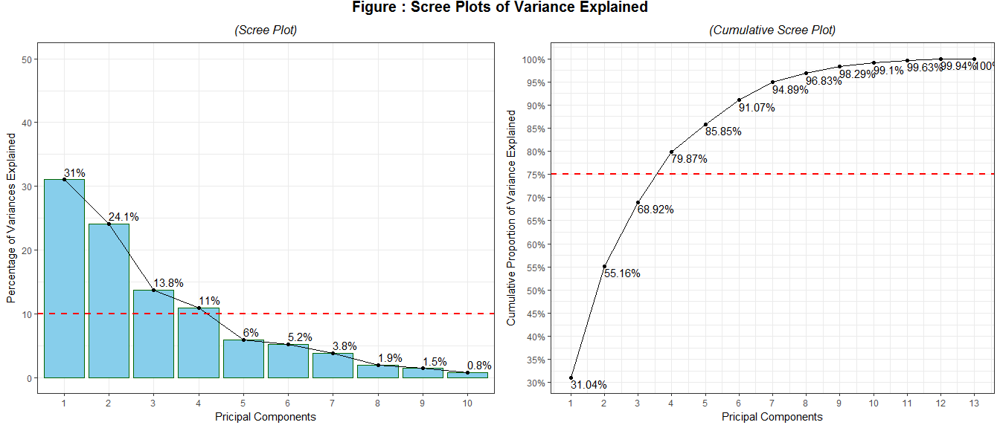
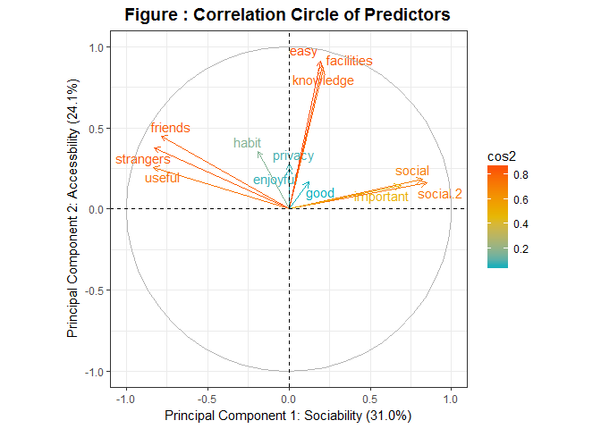
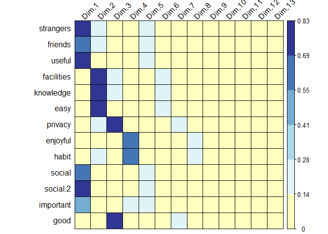

```r
setwd("D:/My Documents/Senior Year/Social Survey")
if(!file.exists("social media.csv")){
        download.file("https://github.com/QuinninR/QuinninR-sample-analysis/blob/master/Data/social%20media.csv", "social media.csv")}

library(readr)
library(dplyr)
media <- tbl_df(read_csv("social media.csv"))
```


```r
glimpse(media)
```

```
## Observations: 307
## Variables: 40
## $ order             <int> 9, 10, 11, 12, 13, 14, 15, 16, 17, 18, 19, 2...
## $ gender            <int> 2, 2, 1, 1, 1, 2, 1, 2, 1, 2, 2, 2, 2, 2, 2,...
## $ home              <int> 2, 2, 3, 2, 2, 1, 1, 2, 2, 3, 1, 2, 1, 2, 1,...
## $ university        <int> 1, 1, 1, 1, 1, 1, 1, 2, 1, 1, 1, 1, 1, 1, 1,...
## $ major             <int> 1, 1, 1, 1, 1, 1, 1, 4, 1, 1, 1, 1, 1, 1, 1,...
## $ before.university <int> 1, 1, 3, 1, 1, 1, 1, 3, 1, 2, 1, 1, 1, 1, 1,...
## $ post.university   <int> 2, 3, 3, 2, 2, 1, 2, 3, 3, 2, 3, 2, 3, 1, 2,...
## $ qq.time           <int> 1, 2, 2, 1, 4, 4, 3, 1, 4, 1, 2, 2, 3, 4, 1,...
## $ wechat.time       <int> 3, 2, 3, 3, 4, 3, 4, 3, 4, 4, 2, 4, 4, 2, 2,...
## $ qq.strangers      <int> -3, -3, -3, -3, -3, 4, -3, -3, -3, -3, -3, -...
## $ qq.friends        <int> -3, -3, -3, -3, -3, 6, -3, -3, -3, -3, -3, -...
## $ qq.useful         <int> -3, -3, -3, -3, -3, 6, -3, -3, -3, -3, -3, -...
## $ qq.facilities     <int> -3, -3, -3, -3, -3, 7, -3, -3, -3, -3, -3, -...
## $ qq.knowledge      <int> -3, -3, -3, -3, -3, 7, -3, -3, -3, -3, -3, -...
## $ qq.easy           <int> -3, -3, -3, -3, -3, 7, -3, -3, -3, -3, -3, -...
## $ qq.privacy        <int> -3, -3, -3, -3, -3, 5, -3, -3, -3, -3, -3, -...
## $ qq.enjoyful       <int> -3, -3, -3, -3, -3, 5, -3, -3, -3, -3, -3, -...
## $ qq.habit          <int> -3, -3, -3, -3, -3, 6, -3, -3, -3, -3, -3, -...
## $ qq.social         <int> -3, -3, -3, -3, -3, 4, -3, -3, -3, -3, -3, -...
## $ qq.social.2       <int> -3, -3, -3, -3, -3, 5, -3, -3, -3, -3, -3, -...
## $ qq.important      <int> -3, -3, -3, -3, -3, 5, -3, -3, -3, -3, -3, -...
## $ qq.good           <int> -3, -3, -3, -3, -3, 5, -3, -3, -3, -3, -3, -...
## $ wechat.strangers  <int> 1, -3, -3, 6, 4, -3, 5, -3, -3, 4, -3, 1, -3...
## $ wechat.friends    <int> 6, -3, -3, 6, 6, -3, 5, -3, -3, 4, -3, 5, -3...
## $ wechat.useful     <int> 6, -3, -3, 7, 7, -3, 7, -3, -3, 5, -3, 6, -3...
## $ wechat.facilities <int> 7, -3, -3, 7, 7, -3, 7, -3, -3, 6, -3, 6, -3...
## $ wechat.knowledge  <int> 7, -3, -3, 7, 7, -3, 7, -3, -3, 6, -3, 6, -3...
## $ wechat.easy       <int> 7, -3, -3, 6, 7, -3, 7, -3, -3, 5, -3, 6, -3...
## $ wechat.privacy    <int> 2, -3, -3, 4, 6, -3, 3, -3, -3, 5, -3, 5, -3...
## $ wechat.enjoyful   <int> 4, -3, -3, 6, 7, -3, 6, -3, -3, 6, -3, 5, -3...
## $ wechat.habit      <int> 6, -3, -3, 6, 7, -3, 7, -3, -3, 7, -3, 5, -3...
## $ wechat.social     <int> 6, -3, -3, 7, 4, -3, 5, -3, -3, 4, -3, 4, -3...
## $ wechat.social.2   <int> 6, -3, -3, 5, 4, -3, 4, -3, -3, 3, -3, 4, -3...
## $ wechat.important  <int> 6, -3, -3, 6, 7, -3, 7, -3, -3, 4, -3, 4, -3...
## $ wechat.good       <int> 4, -3, -3, 6, 6, -3, 6, -3, -3, 4, -3, 5, -3...
## $ same.function     <int> -3, 0, 0, -3, -3, -3, -3, 1, 1, -3, 1, -3, 1...
## $ same.useful       <int> -3, 1, 1, -3, -3, -3, -3, 0, 1, -3, 0, -3, 1...
## $ same.social       <int> -3, 0, 0, -3, -3, -3, -3, 0, 1, -3, 0, -3, 1...
## $ same.doNotCare    <int> -3, 0, 0, -3, -3, -3, -3, 0, 1, -3, 0, -3, 0...
## $ same.others       <int> -3, 0, 0, -3, -3, -3, -3, 0, 0, -3, 0, -3, 0...
```


```r
# set order to track records
rownames(media) <- media$order
media <- media %>%
        select(-order)

# replace all -3 with NAs
library(naniar)

media <- media %>% 
        replace_with_na_all(condition = ~.x == -3)

# split the dataset for different analysis available
incomlete <- media %>%
        filter(post.university == 3) %>%
        select(-c(qq.strangers : wechat.good))

complete <- media %>%
        filter(post.university != 3) %>%
        select(-c(same.function : same.others))
```


```r
library(tidyr)

complete[is.na(complete)] <- ""
complete <- complete %>%
        unite("strangers", qq.strangers, wechat.strangers, sep = "") %>%
        unite("friends", qq.friends, wechat.friends, sep = "") %>%
        unite("useful", qq.useful, wechat.useful, sep = "") %>%
        unite("facilities", qq.facilities, wechat.facilities, sep = "") %>%
        unite("knowledge", qq.knowledge, wechat.knowledge, sep = "") %>%
        unite("easy", qq.easy, wechat.easy, sep = "") %>%
        unite("privacy", qq.privacy, wechat.privacy, sep = "") %>%
        unite("enjoyful", qq.enjoyful, wechat.enjoyful, sep = "") %>%
        unite("habit", qq.habit, wechat.habit, sep = "") %>%
        unite("social", qq.social, wechat.social, sep = "") %>%
        unite("social.2", qq.social.2, wechat.social.2, sep = "") %>%
        unite("important", qq.important, wechat.important, sep = "") %>%
        unite("good", qq.good, wechat.good, sep = "") %>%
        mutate(preference = abs(wechat.time - qq.time)) %>%
        apply(2, as.numeric) %>%
        tbl_df()
```


```r
pca <- complete %>%
        select(strangers:good)

matrix(c(colMeans(pca), apply(pca, 2, sd)), byrow = F, ncol = 2, 
       dimnames = list(colnames(pca), c("Mean", "Standard Deviation")))
```

               Mean Standard Deviation
strangers  2.827586          1.2915673
friends    5.665025          1.1152003
useful     5.295567          1.1779030
facilities 6.497537          0.5483945
knowledge  6.463054          0.6152875
easy       5.571429          0.6883554
privacy    3.118227          1.0743696
enjoyful   5.463054          1.3831964
habit      6.059113          1.3557553
social     5.349754          1.1305118
social.2   5.344828          1.0987438
important  5.014778          1.2644328
good       5.911330          0.8742860


```r
library(gridExtra)
library(ggpubr)
library(FactoMineR)
```

```
## Warning: package 'FactoMineR' was built under R version 3.5.1
```

```r
library(factoextra)
```

```
## Warning: package 'factoextra' was built under R version 3.5.1
```

```r
library(scales)

pr.out <- prcomp(pca, center = T, scale = T, tol = 0.5)

# Variability of each principal component: pr.var
pr.var <- pr.out$sdev^2

# Variance explained by each principal component: pve
pve <- pr.var / sum(pr.var)

fig1 <- fviz_eig(pr.out, addlabels = TRUE, ylim = c(0, 50), 
                 barcolor = "darkgreen", barfill = "skyblue") + 
        geom_hline(aes(yintercept = 10), color = "red", linetype = 2, lwd = 1) + 
        labs(x = "Pricipal Components",
             y = "Percentage of Variances Explained",
             title = "(Scree Plot)") +
        theme_bw() +
        theme(plot.title = element_text(hjust = 0.5, vjust = 1, size = 12, face = "italic"))

# Plot cumulative proportion of variance explained
fig2 <- ggplot(tbl_df(pve), aes(x = 1:13, y = cumsum(value))) + 
        geom_line() + 
        geom_point() + 
        geom_text(aes(label = paste(round(cumsum(value), digits = 4) * 100, "%", sep = "")),
                  hjust = 0, vjust = 1.2) + 
        geom_hline(aes(yintercept = 0.8), color = "red", linetype = 2, lwd = 1) + 
        labs(x = "Pricipal Components",
             y = "Cumulative Proportion of Variance Explained",
             title = "(Cumulative Scree Plot)") + 
        scale_x_continuous(breaks = 1:13) + 
        scale_y_continuous(breaks = seq(0.3, 1, by = 0.05), labels = percent_format()) +
        theme_bw() +
        theme(plot.title = element_text(hjust = 0.5, vjust = 1, size = 12, face = "italic"))

main = text_grob("Figure : Scree Plots of Variance Explained",
                 size = 15, face = "bold", hjust = 0.5, vjust = 0.2)

grid.arrange(fig1, fig2, ncol = 2, top = main)
```

<!-- -->

```r
ggsave("Scree Plots of Variance Explained.png", device = 'png', 
       width = 14, height = 6, dpi = 900, 
       plot = grid.arrange(fig1, fig2, ncol = 2, top = main)) 
```


```r
fig.3 <- fviz_pca_var(pr.out, col.var = "cos2",
             gradient.cols = c("#00AFBB", "#E7B800", "#FC4E07"), 
             repel = TRUE) +  
        labs(x = "Principal Component 1: Sociability (33.8%)",
             y = "Principal Component 2: Accessbility (20.6%)",
             title = "Figure : Correlation Circle of Predictors") + 
        theme_bw() + 
        theme(plot.title = element_text(hjust = 0.5, vjust = 1,
                                        size = 14, face = "bold"))

fig.3
```

<!-- -->

```r
ggsave("Correlation Circle of Predictors.png", device = 'png', 
       width = 8, height = 7, dpi = 900, 
       plot = fig.3) 
```


```r
library(corrplot)
library(RColorBrewer)

cos2 <- get_pca_var(pr.out)$cos2

png("Quality of Representation.png", width = 900, height = 800)
corrplot(cos2, is.corr = FALSE, method = "color", 
         col= brewer.pal(n = 16, name = "RdYlBu"), outline = "black",
         tl.col = "black", tl.srt = 45)
dev.off()
```

```
## png 
##   2
```

```r
corrplot(cos2, is.corr = FALSE, method = "color", 
         col= brewer.pal(n = 16, name = "RdYlBu"), outline = "black",
         tl.col = "black", tl.srt = 45)
```

<!-- -->


```r
pca_rotated <- tbl_df(pr.out$x)[, 1:4]

complete <- complete %>%
        select(-c(qq.time:good)) %>%
        cbind(pca_rotated) %>%
        mutate(gender = factor(gender, labels= c("Male", "Female")),
               major = factor(major, labels = c("Humanities or Social Sciences",
                                                "Business",
                                                "Science",
                                                "Engeneering",
                                                "Arts, Sports or Others")))
```


```r
library(VGAM)

f <- preference ~ gender + major + PC1 + PC2 + PC3 + PC4
lm <- lm(f, data  = complete)
summary(lm)
```

```
## 
## Call:
## lm(formula = f, data = complete)
## 
## Residuals:
##     Min      1Q  Median      3Q     Max 
## -1.5815 -0.1003  0.0089  0.1320  1.6507 
## 
## Coefficients:
##                             Estimate Std. Error t value
## (Intercept)                  1.71156    0.04519  37.872
## genderFemale                 0.02453    0.04775   0.514
## majorBusiness               -0.11548    0.06875  -1.680
## majorScience                -0.10173    0.06141  -1.657
## majorEngeneering            -0.02923    0.06822  -0.428
## majorArts, Sports or Others  0.03418    0.11010   0.310
## PC1                          0.45456    0.01091  41.670
## PC2                          0.01481    0.01325   1.118
## PC3                          0.07418    0.01744   4.253
## PC4                          0.02784    0.01960   1.420
##                                         Pr(>|t|)    
## (Intercept)                 < 0.0000000000000002 ***
## genderFemale                              0.6080    
## majorBusiness                             0.0946 .  
## majorScience                              0.0992 .  
## majorEngeneering                          0.6688    
## majorArts, Sports or Others               0.7566    
## PC1                         < 0.0000000000000002 ***
## PC2                                       0.2649    
## PC3                                    0.0000328 ***
## PC4                                       0.1571    
## ---
## Signif. codes:  0 '***' 0.001 '**' 0.01 '*' 0.05 '.' 0.1 ' ' 1
## 
## Residual standard error: 0.3247 on 193 degrees of freedom
## Multiple R-squared:  0.9041,	Adjusted R-squared:  0.8996 
## F-statistic: 202.2 on 9 and 193 DF,  p-value: < 0.00000000000000022
```


