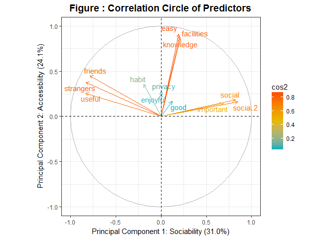
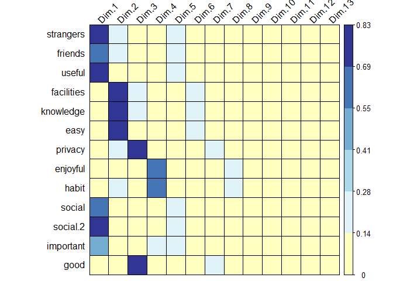

# 研究概要

**研究问题**  大学生即时通讯软件使用偏好的影响因素

**数据收集**  [问卷](https://www.wjx.cn/m/24473165.aspx)

**统计推断**

* 性质：相关关系推断；
* 适用范围：仅适用于本样本，不可推广

**研究方法**  

* 主成分分析法；
* 多重线性回归

**研究结论**

# 问卷设计导致的数据问题清单

* 问卷中，若作答人在选择上大学后使用频率较高的即时通讯软件时，明确选择了QQ或者微信，则后续问卷问题的回答只反映其对QQ或者微信在多个维度（绩效期望，便利条件，娱乐性，习惯，社会影响）的表现的评估。如果作为自变量，预期仅能反映其对该款软件的偏好，不能预测其选择QQ或是微信

解决方法：以其偏好软件的使用时长作为代理变量

* 问卷中，若作答人在选择上大学后使用频率较高的即时通讯软件时，选择“两者大致相当”，第9题的选项仅涵盖绩效期望、社会影响，不能对应有明确偏好者在所有维度对所用即时通讯软件的评价。这部分观察值无效

解决方法：去掉无明确偏好者

# 数据报告说明

首先合成对QQ和对微信的评价为对所偏好的通讯软件在多个维度上的评价，接着对各维度做主成分分析。维度的中英文对应为去掉第21题后按顺序对应。

下表为各维度的均值和标准差情况。

```r
pca <- complete %>%
        select(strangers:good)

matrix(c(colMeans(pca), apply(pca, 2, sd)), byrow = F, ncol = 2, 
       dimnames = list(colnames(pca), c("Mean", "Standard Deviation")))
```

               Mean Standard Deviation
strangers  3.743842          1.1787722
friends    5.665025          1.1672547
useful     5.206897          1.1198266
facilities 6.472906          0.5477270
knowledge  6.453202          0.6065052
easy       5.502463          0.6322550
privacy    2.684729          0.8199935
enjoyful   5.463054          1.3831964
habit      6.059113          1.3557553
social     5.285714          0.7624497
social.2   5.285714          0.7360201
important  4.852217          0.9053376
good       5.546798          0.5899548

可以看到均值和标准差有较大差异，在进行主成分分析时需要注意先做标准化。

下图左展示了各个主成分所解释的variance比例；下图右展示了累计解释比例。

<!-- -->

可以看出，头四个主成分累计解释了80%左右的variance，且每个主成分所解释variance比例均在10%以上，采用头四个主成分可以对13个变量良好地降维。

下图展示了各变量与头两个主成分的相关关系。方向相近的箭头表示对应变量相关，相背的箭头表示无关，箭头长度和颜色均衡量quality of representation，即该变量在各主成分中所解释方差的比例（系数绝对值除以系数绝对值之和）。论文中可以不用此图。

<!-- -->

下图可视化了各变量（行）在各主成分（列）中的quality of representation，可以理解为各主成分的主要变量（每个主成分都是变量的线性组合）。蓝色深该变量在该主成分中更重要。

<!-- -->

可以看出，第一主成分代表社交性（绩效期望与社会影响），第二主成分代表便利条件，第三主成分代表隐私保护和舒适度，第四主成分代表习惯和享受性。

下面是各主成分的summary table。

```
## Importance of first k=4 (out of 13) components:
##                           PC1    PC2    PC3    PC4
## Standard deviation     2.0088 1.7709 1.3372 1.1932
## Proportion of Variance 0.3104 0.2412 0.1375 0.1095
## Cumulative Proportion  0.3104 0.5516 0.6892 0.7987
```

下面是旋转矩阵，即各主成分中，各变量的系数。主成分即变量的线性组合，系数乘变量值加和后可得。

```
## # A tibble: 13 x 4
##         PC1    PC2      PC3      PC4
##       <dbl>  <dbl>    <dbl>    <dbl>
##  1  0.411   0.214  -0.178    0.0140 
##  2  0.390   0.254  -0.0872   0.00746
##  3  0.414   0.146  -0.0916   0.0277 
##  4 -0.103   0.499   0.219    0.174  
##  5 -0.105   0.487   0.270    0.124  
##  6 -0.0969  0.513   0.00216  0.172  
##  7 -0.00210 0.156  -0.622   -0.0651 
##  8 -0.00205 0.140   0.0640  -0.689  
##  9  0.0953  0.200   0.0649  -0.614  
## 10 -0.409   0.103  -0.140   -0.0246 
## 11 -0.422   0.0901 -0.157    0.0149 
## 12 -0.342   0.0812 -0.0787  -0.248  
## 13 -0.0616  0.0942 -0.621    0.0699
```

下面对变量做进一步处理：

```r
pca_rotated <- tbl_df(pr.out$x)[, 1:4]

complete <- complete %>%
        select(-c(qq.time:good)) %>%
        cbind(pca_rotated) %>%
        mutate(gender = factor(gender, labels= c("Male", "Female")),
               major = factor(major, labels = c("Humanities or Social Sciences",
                                                "Business",
                                                "Science",
                                                "Engeneering",
                                                "Arts, Sports or Others")),
               type.preference = factor(ifelse(post.university == before.university,
                                               "consistent",
                                               "new"),
                                        levels = c("consistent", "new")),
               type.location = factor(ifelse(university == home,
                                             "same",
                                             "moved"), levels = c("same", "moved")),
               before.university = factor(before.university, labels = c("QQ",
                                                                        "Wechat",
                                                                        "No difference")),
               post.university = factor(post.university, labels = c("QQ",
                                                                    "Wechat")),
               home = factor(home, labels = c("East", "Mid", "West")),
               university = factor(university, labels = c("East", "Mid", "West"))
               )
```

首先，给各变量的值附以可读的label。仅用控制变量建立模型一。下面是模型一的summary。

```
## 
## Call:
## lm(formula = f1, data = complete)
## 
## Residuals:
##     Min      1Q  Median      3Q     Max 
## -2.5032 -0.6021  0.2759  0.6669  1.3745 
## 
## Coefficients:
##                                 Estimate Std. Error t value
## (Intercept)                     3.090281   0.191563  16.132
## genderFemale                    0.420365   0.142350   2.953
## majorBusiness                   0.331890   0.207187   1.602
## majorScience                   -0.384517   0.187452  -2.051
## majorEngeneering               -0.272341   0.212182  -1.284
## majorArts, Sports or Others    -0.457318   0.326315  -1.401
## homeMid                         0.095194   0.159653   0.596
## homeWest                       -0.019859   0.179161  -0.111
## universityMid                  -0.178024   0.212261  -0.839
## universityWest                 -0.143863   0.319320  -0.451
## before.universityWechat        -0.034541   0.221845  -0.156
## before.universityNo difference -0.028156   0.258861  -0.109
## post.universityWechat          -0.007469   0.157312  -0.047
##                                            Pr(>|t|)    
## (Intercept)                    < 0.0000000000000002 ***
## genderFemale                                0.00354 ** 
## majorBusiness                               0.11084    
## majorScience                                0.04161 *  
## majorEngeneering                            0.20087    
## majorArts, Sports or Others                 0.16271    
## homeMid                                     0.55171    
## homeWest                                    0.91186    
## universityMid                               0.40269    
## universityWest                              0.65284    
## before.universityWechat                     0.87644    
## before.universityNo difference              0.91350    
## post.universityWechat                       0.96218    
## ---
## Signif. codes:  0 '***' 0.001 '**' 0.01 '*' 0.05 '.' 0.1 ' ' 1
## 
## Residual standard error: 0.9429 on 190 degrees of freedom
## Multiple R-squared:  0.1332,	Adjusted R-squared:  0.07851 
## F-statistic: 2.434 on 12 and 190 DF,  p-value: 0.005774
```

多变量不显著。预期是单纯直接地使用这些变量没有办法预测偏好强度。合成新变量：

* 偏好类型：若上大学前后偏好有改变，则new，否则consistent。
* 所在地类型：若大学与家乡所在地不同，则moved，否则same。

去掉重复的相关变量，再用控制变量建立模型二。

```
## 
## Call:
## lm(formula = f2, data = complete)
## 
## Residuals:
##     Min      1Q  Median      3Q     Max 
## -2.3774 -0.3616  0.1576  0.5047  1.6384 
## 
## Coefficients:
##                             Estimate Std. Error t value
## (Intercept)                  3.69544    0.14173  26.074
## genderFemale                 0.30778    0.12325   2.497
## majorBusiness                0.09198    0.17652   0.521
## majorScience                -0.31807    0.15607  -2.038
## majorEngeneering            -0.41884    0.17687  -2.368
## majorArts, Sports or Others -0.35562    0.27943  -1.273
## type.preferencenew          -0.48080    0.13735  -3.501
## type.locationmoved          -0.53493    0.13833  -3.867
##                                         Pr(>|t|)    
## (Intercept)                 < 0.0000000000000002 ***
## genderFemale                            0.013344 *  
## majorBusiness                           0.602917    
## majorScience                            0.042893 *  
## majorEngeneering                        0.018863 *  
## majorArts, Sports or Others             0.204653    
## type.preferencenew                      0.000575 ***
## type.locationmoved                      0.000150 ***
## ---
## Signif. codes:  0 '***' 0.001 '**' 0.01 '*' 0.05 '.' 0.1 ' ' 1
## 
## Residual standard error: 0.8288 on 195 degrees of freedom
## Multiple R-squared:  0.3127,	Adjusted R-squared:  0.288 
## F-statistic: 12.67 on 7 and 195 DF,  p-value: 0.0000000000002273
```

效果还行。依次加入各个主成分，分别建立模型三、四、五、六：

```r
f3 <- preference ~ gender + major + type.preference + type.location + PC1
lm3 <- lm(f3, data  = complete)
summary(lm3)
```

```
## 
## Call:
## lm(formula = f3, data = complete)
## 
## Residuals:
##      Min       1Q   Median       3Q      Max 
## -2.28793 -0.19565  0.01383  0.24519  0.87990 
## 
## Coefficients:
##                             Estimate Std. Error t value
## (Intercept)                  3.42610    0.07675  44.639
## genderFemale                 0.11401    0.06648   1.715
## majorBusiness                0.02744    0.09443   0.291
## majorScience                -0.09715    0.08404  -1.156
## majorEngeneering            -0.14113    0.09540  -1.479
## majorArts, Sports or Others -0.04798    0.15005  -0.320
## type.preferencenew          -0.19487    0.07457  -2.613
## type.locationmoved          -0.29968    0.07472  -4.011
## PC1                          0.37581    0.01701  22.094
##                                         Pr(>|t|)    
## (Intercept)                 < 0.0000000000000002 ***
## genderFemale                             0.08792 .  
## majorBusiness                            0.77168    
## majorScience                             0.24912    
## majorEngeneering                         0.14067    
## majorArts, Sports or Others              0.74949    
## type.preferencenew                       0.00967 ** 
## type.locationmoved                     0.0000864 ***
## PC1                         < 0.0000000000000002 ***
## ---
## Signif. codes:  0 '***' 0.001 '**' 0.01 '*' 0.05 '.' 0.1 ' ' 1
## 
## Residual standard error: 0.4431 on 194 degrees of freedom
## Multiple R-squared:  0.8045,	Adjusted R-squared:  0.7965 
## F-statistic:  99.8 on 8 and 194 DF,  p-value: < 0.00000000000000022
```


```r
f4 <- preference ~ gender + major + type.preference + type.location + PC1 + PC2
lm4 <- lm(f4, data  = complete)
summary(lm4)
```

```
## 
## Call:
## lm(formula = f4, data = complete)
## 
## Residuals:
##      Min       1Q   Median       3Q      Max 
## -2.50787 -0.23882  0.04055  0.27513  0.81557 
## 
## Coefficients:
##                             Estimate Std. Error t value
## (Intercept)                  3.42647    0.07353  46.600
## genderFemale                 0.10395    0.06373   1.631
## majorBusiness               -0.01844    0.09109  -0.202
## majorScience                -0.11269    0.08059  -1.398
## majorEngeneering            -0.14620    0.09140  -1.599
## majorArts, Sports or Others -0.05171    0.14375  -0.360
## type.preferencenew          -0.15070    0.07218  -2.088
## type.locationmoved          -0.31197    0.07164  -4.355
## PC1                          0.37912    0.01631  23.239
## PC2                          0.07380    0.01722   4.286
##                                         Pr(>|t|)    
## (Intercept)                 < 0.0000000000000002 ***
## genderFemale                              0.1045    
## majorBusiness                             0.8398    
## majorScience                              0.1636    
## majorEngeneering                          0.1113    
## majorArts, Sports or Others               0.7195    
## type.preferencenew                        0.0381 *  
## type.locationmoved                     0.0000216 ***
## PC1                         < 0.0000000000000002 ***
## PC2                                    0.0000287 ***
## ---
## Signif. codes:  0 '***' 0.001 '**' 0.01 '*' 0.05 '.' 0.1 ' ' 1
## 
## Residual standard error: 0.4245 on 193 degrees of freedom
## Multiple R-squared:  0.8215,	Adjusted R-squared:  0.8132 
## F-statistic:  98.7 on 9 and 193 DF,  p-value: < 0.00000000000000022
```


```r
f5 <- preference ~ gender + major + type.preference + type.location + PC1 + PC2 + PC3
lm5 <- lm(f5, data  = complete)
summary(lm5)
```

```
## 
## Call:
## lm(formula = f5, data = complete)
## 
## Residuals:
##      Min       1Q   Median       3Q      Max 
## -2.48320 -0.23753  0.03918  0.27774  0.80054 
## 
## Coefficients:
##                             Estimate Std. Error t value
## (Intercept)                  3.43095    0.07434  46.154
## genderFemale                 0.10217    0.06398   1.597
## majorBusiness               -0.01661    0.09137  -0.182
## majorScience                -0.11674    0.08125  -1.437
## majorEngeneering            -0.14419    0.09170  -1.572
## majorArts, Sports or Others -0.05085    0.14406  -0.353
## type.preferencenew          -0.15492    0.07291  -2.125
## type.locationmoved          -0.31417    0.07195  -4.366
## PC1                          0.37862    0.01638  23.109
## PC2                          0.07357    0.01726   4.262
## PC3                          0.01056    0.02319   0.456
##                                         Pr(>|t|)    
## (Intercept)                 < 0.0000000000000002 ***
## genderFemale                              0.1119    
## majorBusiness                             0.8559    
## majorScience                              0.1524    
## majorEngeneering                          0.1175    
## majorArts, Sports or Others               0.7245    
## type.preferencenew                        0.0349 *  
## type.locationmoved                     0.0000206 ***
## PC1                         < 0.0000000000000002 ***
## PC2                                    0.0000317 ***
## PC3                                       0.6493    
## ---
## Signif. codes:  0 '***' 0.001 '**' 0.01 '*' 0.05 '.' 0.1 ' ' 1
## 
## Residual standard error: 0.4254 on 192 degrees of freedom
## Multiple R-squared:  0.8217,	Adjusted R-squared:  0.8124 
## F-statistic: 88.48 on 10 and 192 DF,  p-value: < 0.00000000000000022
```


```r
f6 <- preference ~ gender + major + type.preference + type.location + PC1 + PC2 + PC3 + PC4
lm6 <- lm(f6, data  = complete)
summary(lm6)
```

```
## 
## Call:
## lm(formula = f6, data = complete)
## 
## Residuals:
##      Min       1Q   Median       3Q      Max 
## -2.48966 -0.24095  0.02513  0.27974  0.79675 
## 
## Coefficients:
##                             Estimate Std. Error t value
## (Intercept)                  3.42893    0.07430  46.149
## genderFemale                 0.10680    0.06406   1.667
## majorBusiness               -0.01839    0.09131  -0.201
## majorScience                -0.12051    0.08125  -1.483
## majorEngeneering            -0.15404    0.09204  -1.674
## majorArts, Sports or Others -0.05599    0.14402  -0.389
## type.preferencenew          -0.15515    0.07286  -2.129
## type.locationmoved          -0.30879    0.07205  -4.285
## PC1                          0.37851    0.01637  23.120
## PC2                          0.07365    0.01725   4.269
## PC3                          0.01008    0.02317   0.435
## PC4                          0.02873    0.02531   1.135
##                                         Pr(>|t|)    
## (Intercept)                 < 0.0000000000000002 ***
## genderFemale                              0.0971 .  
## majorBusiness                             0.8406    
## majorScience                              0.1397    
## majorEngeneering                          0.0958 .  
## majorArts, Sports or Others               0.6979    
## type.preferencenew                        0.0345 *  
## type.locationmoved                     0.0000289 ***
## PC1                         < 0.0000000000000002 ***
## PC2                                    0.0000308 ***
## PC3                                       0.6640    
## PC4                                       0.2577    
## ---
## Signif. codes:  0 '***' 0.001 '**' 0.01 '*' 0.05 '.' 0.1 ' ' 1
## 
## Residual standard error: 0.4251 on 191 degrees of freedom
## Multiple R-squared:  0.8229,	Adjusted R-squared:  0.8127 
## F-statistic: 80.68 on 11 and 191 DF,  p-value: < 0.00000000000000022
```
