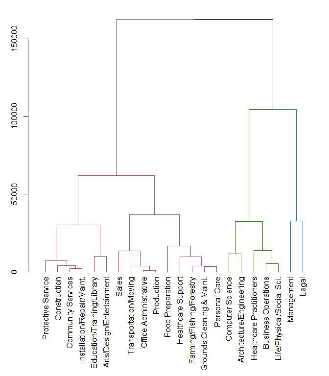

# Executive Summary

This report is created to identify clusters of occupations that maintained similar income trends based on the *Occupational Employment Statistics (OES)* data, which contains the yearly average income from 2001 to 2016 for 22 occupation groups.

# Data Pre-processing

Load the dataset.


```r
# set working directory
setwd("D:/My Documents/DataCamp/Cluster Analysis")
# download data
if(!file.exists("oes.rds")){
        download.file("https://assets.datacamp.com/production/course_5390/datasets/oes.rds", "oes.rds")
        dateDownloaded <- date()}

# load data
oes <- data.frame(readRDS('oes.rds'))
```


```r
str(oes)
```

```
## 'data.frame':	22 obs. of  15 variables:
##  $ X2001: num  70800 50580 60350 56330 49710 ...
##  $ X2002: num  78870 53350 61630 58020 52380 ...
##  $ X2003: num  83400 56000 64150 60390 54930 ...
##  $ X2004: num  87090 57120 66370 63060 57550 ...
##  $ X2005: num  88450 57930 67100 63910 58030 ...
##  $ X2006: num  91930 60000 69240 66190 59660 ...
##  $ X2007: num  96150 62410 72190 68880 62020 ...
##  $ X2008: num  100310 64720 74500 71430 64280 ...
##  $ X2010: num  105440 67690 77230 75550 66390 ...
##  $ X2011: num  107410 68740 78730 77120 67470 ...
##  $ X2012: num  108570 69550 80180 79000 68360 ...
##  $ X2013: num  110550 71020 82010 80100 69400 ...
##  $ X2014: num  112490 72410 83970 81520 70070 ...
##  $ X2015: num  115020 73800 86170 82980 71220 ...
##  $ X2016: num  118020 75070 87880 84300 72930 ...
```

# Hierarchical Clustering


```r
library(dendextend)

# Calculate euclidean distance between the occupations
dist_oes <- dist(oes, method = 'euclidean')

# Generate an average linkage analysis 
hc_oes <- hclust(dist_oes, method = 'average')

# Color branches by cluster formed from the cut at a height of 100000
dend_colored <- color_branches(hc_oes, h = 100000)

# Plot the colored dendrogram
par(mar=c(10,3,1,1))
plot(dend_colored)
```

<!-- -->

