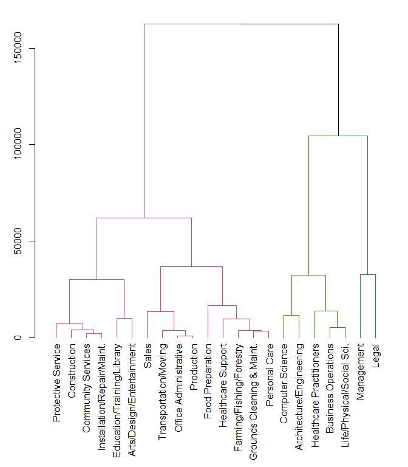
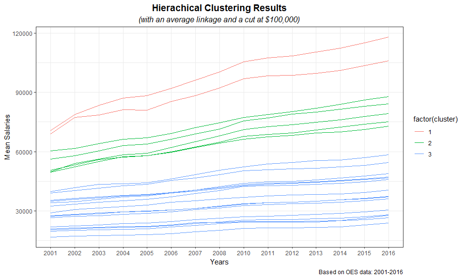
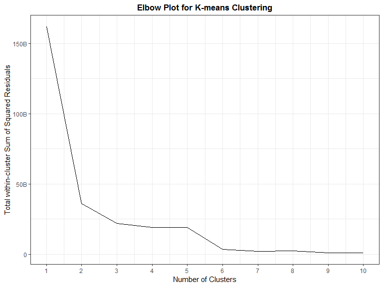
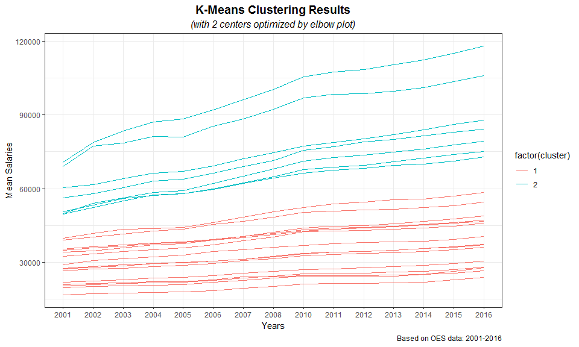
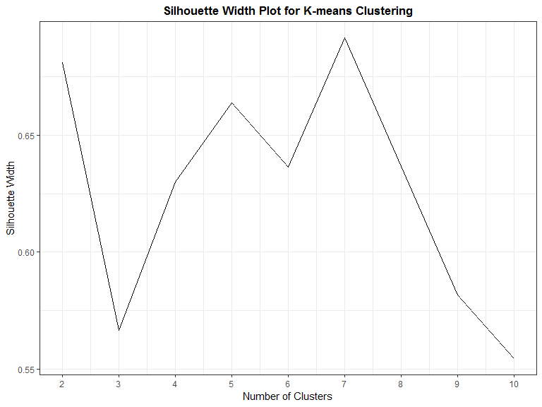
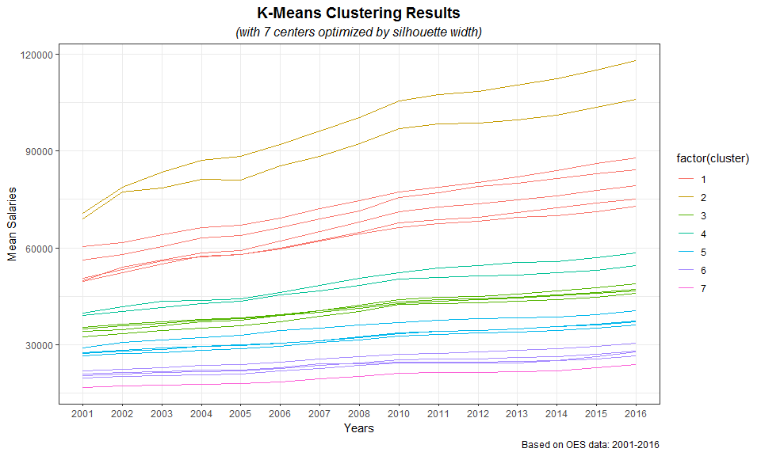
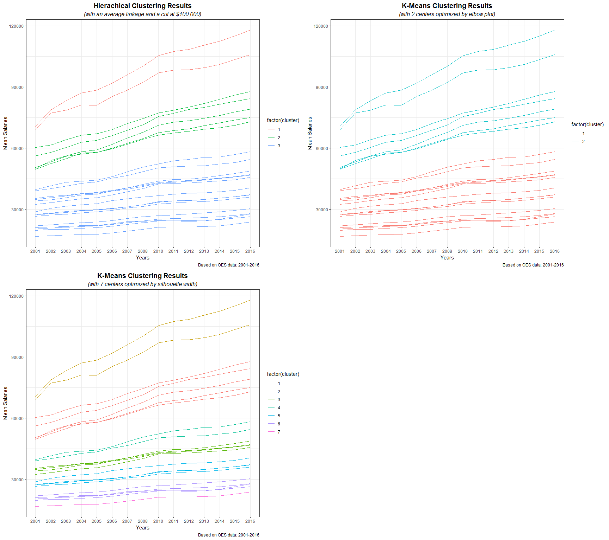

# Executive Summary

This report is created to identify clusters of occupations that maintained similar income trends based on the *Occupational Employment Statistics (OES)* data, which contains the yearly average income from 2001 to 2016 for 22 occupation groups.

# Data Pre-processing

Download the data and load it into our working environment.


```r
# set working directory
setwd("D:/My Documents/DataCamp/Cluster Analysis")

# download data
if(!file.exists("oes.rds")){
        download.file("https://assets.datacamp.com/production/course_5390/datasets/oes.rds", "oes.rds")
        dateDownloaded <- date()}

# load data
oes <- readRDS('oes.rds')
```

OES data was downloaded as `oes.rds` and loaded as `oes`.


```r
# check missing values, means and standard deviations
summary(oes)
```

```
##       2001            2002            2003            2004      
##  Min.   :16720   Min.   :17180   Min.   :17400   Min.   :17620  
##  1st Qu.:26728   1st Qu.:27393   1st Qu.:27858   1st Qu.:28535  
##  Median :34575   Median :35205   Median :36180   Median :37335  
##  Mean   :37850   Mean   :39701   Mean   :41018   Mean   :42275  
##  3rd Qu.:49875   3rd Qu.:53108   3rd Qu.:55733   3rd Qu.:57443  
##  Max.   :70800   Max.   :78870   Max.   :83400   Max.   :87090  
##       2005            2006            2007            2008       
##  Min.   :17840   Min.   :18430   Min.   :19440   Min.   : 20220  
##  1st Qu.:29043   1st Qu.:29688   1st Qu.:30810   1st Qu.: 31643  
##  Median :37790   Median :39030   Median :40235   Median : 41510  
##  Mean   :42775   Mean   :44329   Mean   :46074   Mean   : 47763  
##  3rd Qu.:58005   3rd Qu.:59915   3rd Qu.:62313   3rd Qu.: 64610  
##  Max.   :88450   Max.   :91930   Max.   :96150   Max.   :100310  
##       2010             2011             2012             2013       
##  Min.   : 21240   Min.   : 21430   Min.   : 21380   Min.   : 21580  
##  1st Qu.: 32863   1st Qu.: 33430   1st Qu.: 33795   1st Qu.: 34120  
##  Median : 42995   Median : 43610   Median : 44055   Median : 44565  
##  Mean   : 49758   Mean   : 50555   Mean   : 51077   Mean   : 51800  
##  3rd Qu.: 67365   3rd Qu.: 68423   3rd Qu.: 69253   3rd Qu.: 70615  
##  Max.   :105440   Max.   :107410   Max.   :108570   Max.   :110550  
##       2014             2015             2016       
##  Min.   : 21980   Min.   : 22850   Min.   : 23850  
##  1st Qu.: 34718   1st Qu.: 35425   1st Qu.: 36350  
##  Median : 45265   Median : 46075   Median : 46945  
##  Mean   : 52643   Mean   : 53785   Mean   : 55117  
##  3rd Qu.: 71825   3rd Qu.: 73155   3rd Qu.: 74535  
##  Max.   :112490   Max.   :115020   Max.   :118020
```

```r
matrix(c(colMeans(oes), apply(oes, 2, sd)), byrow = F, ncol = 2,
       dimnames = list(colnames(oes), c("Mean", "Standard Deviations")))
```

```
##          Mean Standard Deviations
## 2001 37850.45            16127.64
## 2002 39701.36            17997.21
## 2003 41018.18            18938.09
## 2004 42275.45            19822.14
## 2005 42774.55            19985.62
## 2006 44329.09            20914.82
## 2007 46074.09            21832.02
## 2008 47762.73            22833.29
## 2010 49757.73            24091.43
## 2011 50555.45            24603.72
## 2012 51076.82            24946.34
## 2013 51800.45            25428.96
## 2014 52642.73            25864.82
## 2015 53784.55            26389.16
## 2016 55117.27            26842.83
```

Wage data is stored by years as columns, occupation groups as rows. There is no missing value, while means and standard deviations vary across years.

# Hierarchical Clustering

Perform hierachical clustering with an average linkage. 


```r
# Calculate euclidean distance between the occupations
dist_oes <- dist(oes, method = 'euclidean')

# Generate an average linkage analysis 
hc_oes <- hclust(dist_oes, method = 'average')
```

Draw a colored dendrogram with a cut at 100,000.


```r
library(dendextend)

# Color branches by cluster formed from the cut at a height of 100000
dend_colored <- color_branches(hc_oes, h = 100000)

# Plot the colored dendrogram
par(mar=c(10,3,1,1))
plot(dend_colored)
```



Add two variables to `oes`, while `occupation` refers to the occupation group and `clust_oes` refers to the resluting cluster assignments. Since `oes` stores years in column names, which instead should be values, gather the year and values (mean salary) into two columns. 

Use a function `gather_cluster()` to achieve this for future use.


```r
library(tidyverse)

gather_cluster <- function(cluster){
      # Use rownames_to_column to move the rownames into a column of the data frame
        df_oes <- rownames_to_column(as.data.frame(oes), var = 'occupation')
        
      # Generate the segmented the oes dataframe
        clust_oes <- df_oes %>%
                mutate(cluster = cluster)
      # Create a tidy data frame by gathering the year and values into two columns
        temp <- gather(data = clust_oes, 
                       key = year, 
                       value = mean_salary, 
                       -occupation, -cluster)
}

# Create a cluster assignment vector at h = 100,000
cluster <- cutree(hc_oes, h = 100000)

gathered_oes <- gather_cluster(cluster)
```

Plot the relationship between `mean_salary` and `year` and color the lines by the assigned cluster.


```r
hclPlot <- ggplot(gathered_oes, aes(x = year, y = mean_salary, color = factor(cluster))) + 
                geom_line(aes(group = occupation)) + 
                theme_bw() +
                labs(x = "Years", y = "Mean Salaries", 
                     title = "Hierachical Clustering Results", 
                     subtitle = "(with an average linkage and a cut at $100,000)",
                     caption = "Based on OES data: 2001-2016") +
                theme(plot.title = element_text(hjust =0.5, vjust = 1, size = 14, face = "bold"),
                      plot.subtitle = element_text(hjust =0.5, vjust = 1, size = 12, face = "italic"))
### fix the legend here

hclPlot
```



# K-Means CLustering

## Optimized with Elbow Plot

Perform a K-Means Clustering on `oes` data, while `k` ranges from 1 to 10. Use an elbow plot to determine the optimal number of clusters. 


```r
# Use map_dbl to run many models with varying value of k (centers)
tot_withinss <- map_dbl(1:10,  function(k){
  model <- kmeans(x = oes, centers = k)
  model$tot.withinss
})

# Generate a data frame containing both k and tot_withinss
elbow_df <- data.frame(
  k = 1:10,
  tot_withinss = tot_withinss
)

# Plot the elbow plot
ggplot(elbow_df, aes(x = k, y = tot_withinss)) +
         geom_line(lwd = 0.6) +
         theme_bw() +
         scale_x_continuous(breaks = 1:10) + 
         labs(x = "Number of Clusters", y = "Total within-cluster Sum of Squared Residuals",
              title = "Elbow Plot for K-means Clustering") +
         scale_y_continuous(labels = c("0", "50B", "100B", "150B")) + 
         theme(plot.title = element_text(hjust =0.5, vjust = 1, size = 13, face = "bold"))
```



The elbow point is at 2. Plot the relationship between `mean_salary` and `year` and color the lines by the assigned cluster resulting from K-Means Cluserting with a $k = 2$.


```r
KMeans2 <- kmeans(x = oes, centers = 2)

gathered_oes <- gather_cluster(KMeans2$cluster)

km2Plot <- ggplot(gathered_oes, aes(x = year, y = mean_salary, color = factor(cluster))) + 
                geom_line(aes(group = occupation)) + 
                theme_bw() +
                labs(x = "Years", y = "Mean Salaries", 
                     title = "K-Means Clustering Results", 
                     subtitle = "(with 2 centers optimized by elbow plot)",
                     caption = "Based on OES data: 2001-2016") +
                theme(plot.title = element_text(hjust =0.5, vjust = 1, size = 14, face = "bold"),
                      plot.subtitle = element_text(hjust =0.5, vjust = 1, size = 12, face = "italic"))
### fix the legend here

km2Plot
```



## Optimized with Silhouette Width

Perform a K-Means Clustering on `oes` data, while `k` ranges from 2 to 10. Use silhouette width to determine the optimal number of clusters. 


```r
library(cluster)

# Use map_dbl to run many models with varying value of k
sil_width <- map_dbl(2:10,  function(k){
  model <- pam(oes, k = k)
  model$silinfo$avg.width
})

# Generate a data frame containing both k and sil_width
sil_df <- data.frame(
  k = 2:10,
  sil_width = sil_width
)

# Plot the relationship between k and sil_width
ggplot(sil_df, aes(x = k, y = sil_width)) +
        geom_line(lwd = 0.6) +
        theme_bw() +
        scale_x_continuous(breaks = 2:10) + 
        labs(x = "Number of Clusters", y = "Silhouette Width",
             title = "Silhouette Width Plot for K-means Clustering") +
        theme(plot.title = element_text(hjust =0.5, vjust = 1, size = 13, face = "bold"))
```



The maximum silhouette width occurs when $k = 7$. Plot the relationship between `mean_salary` and `year` and color the lines by the assigned cluster resulting from K-Means Cluserting with a $k = 7$.


```r
KMeans7 <- kmeans(x = oes, centers = 7)

gathered_oes <- gather_cluster(KMeans7$cluster)

km7Plot <- ggplot(gathered_oes, aes(x = year, y = mean_salary, color = factor(cluster))) + 
                geom_line(aes(group = occupation)) + 
                theme_bw() +
                labs(x = "Years", y = "Mean Salaries", 
                     title = "K-Means Clustering Results", 
                     subtitle = "(with 7 centers optimized by silhouette width)",
                     caption = "Based on OES data: 2001-2016") +
                theme(plot.title = element_text(hjust =0.5, vjust = 1, size = 14, face = "bold"),
                      plot.subtitle = element_text(hjust =0.5, vjust = 1, size = 12, face = "italic"))
### fix the legend here

km7Plot
```



# Conclusion

Put the three plots together.


```r
library(gridExtra)
grid.arrange(hclPlot, km2Plot, km7Plot, nrow = 2, ncol = 2)
```



